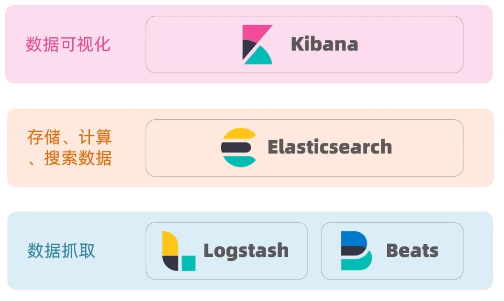
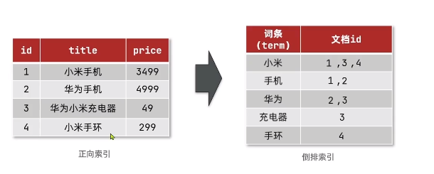
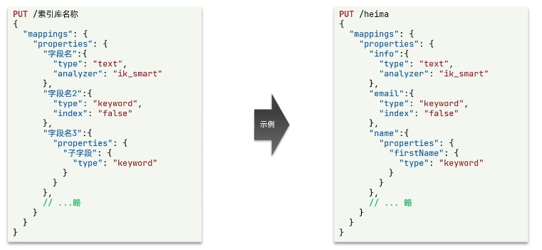

# 微服务
## 业务拆分
将不同业务拆分，要求业务独立，不重复实现功能
## 微服务远程调用
例子：使用SpringCloud提供的RestTemplate
通过http请求来完成相互之间的通信。

## Eureka

服务注册

1.引入依赖：

```xml
<dependency>
	<groupId>org.springframework.cloud</groupId>
    <artifactId>spring-cloud-starter-netflix-eureka-server</artifactId>
</dependency>
```

2.启动类，添加@EnableEurekaServer注解

3.在application.yml中添加Eureka的配置

注册客户端依赖：

```xml
<dependency>
	<groupId>org.springframework.cloud</groupId>
    <artifactId>spring-cloud-starter-netflix-eureka-client</artifactId>
</dependency>
```

需要在application.yml中添加配置。

### 服务拉取

修改某个服务的代码，修改访问url的路径，用服务名代替ip和端口：

```java
String url = "http://userservice/user/" + order.getUserId();
```

在服务项目的启动类中的RestTemplate添加负载均衡的注解：

```java
@Bean
@LoadBalanced
public RestTemplate restTemplate(){
    return new RestTemplate();
}
```

## Ribbon负载均衡

Eureka的负载均衡由Ribbon组件完成。

http请求被Ribbon拦截，然后Ribbon向Eureka拉取服务列表，然后根据设定的规则进行服务器的选择。


负载均衡的配置：

1.全局，代码：

```java
@Bean
public IRule randomRule(){
    return new RandomRule();
}
```

2.配置文件：在对应服务的application.yml中，添加新的配置/修改规则：->针对某个微服务

```yml
userservice:
	ribbon:
		NFLoadBalancerRuleClassName: com.netflix.loadbalancer.RandomRule
```

## Nacos

服务注册，比Eureka功能更丰富。

服务注册到Nacos：

1.在cloud-demo父工程中添加spring-cloud-alilbaba的管理依赖：

```xml
<dependency>
	<groupId>com.alibaba.cloud</groupId>
    <artifactId>spring-cloud-alibaba-dependencies</artifactId>
    <version>2.2.5.RELEASE</version>
    <type>pom</type>
    <scope>import</scope>
</dependency>
```

2.注释掉order-service和user-service中原有的eureka依赖

3.添加nacos的客户端依赖：

```xml
<dependency>
	<groupId>com.alibaba.cloud</groupId>
    <artifactId>spring-cloud-starter-alibaba-nacos-discovery</artifactId>
</dependency>
```

4.修改user-service和order-service中的application.yml文件，注释eureka地址，添加nacos地址

```yml
spring:
	cloud:
		nacos:
			server-addr: localhost:8848
```

5.启动并测试

**nacos服务分级存储模型**：

一个服务可以有多个实例。


可以在application.yml中设置集群的属性cluster-name。

**nacos环境隔离**：

namespace来做环境隔离，可以在服务的配置文件中配置到不同的环境。

不同空间/环境的不能互相访问。

**临时实例**：

临时实例需要给nacos注册中心发心跳包。

非临时实例会被nacos主动询问，即便非临时实例down了，也不会删除，只会标记不健康。

**Nacos配置管理**：

统一配置管理，配置更改热更新。

将统一的配置（有热更新需求的配置）传递到配置管理服务，从这里读取配置，结合本地配置。

1.在Nacos中添加一个新的配置

配置获取的步骤：


2.引入nacos配置管理客户端依赖：

```xml
<dependency>
	<groupId>com.alibaba.cloud</groupId>
    <artifactId>spring-cloud-starter-alibaba-nacos-config</artifactId>
</dependency>
```

3.在微服务的resource目录添加一个`bootstrap.yml`文件，这个文件是引导文件，优先级高于application.yml：

```yml
spring:
	application:
	  name: userservice #service name
	profiles:
	  active: dev #enviroment
	cloud:
	  nacos: 
	    server-addr: localhost:8848 #nacos address
	    config:
	      file-extension: yaml #suffix
# userservice-dev.yaml->nacos上配置文件的名字
```

**配置热更新**：

需要进行配置：

方式一：在@Value注入的变量所在类上添加注解@RefreshScope

```java
@RefreshScope
public class UserControler{
    
    @Value("${pattern.dateformat}")//注入属性
    private String dateformat;
}
```

方式二：使用@ConfigurationProperties注解

```java
@ConfigurationProperties(prefix = "pattern")// 前缀加变量名一样就可以从配置中载入
public class PatternProperties {
    private String dateformat;
}
```

**多环境配置共享**：

微服务启动的时候会从nacos读取多个配置文件：

- [spring.application.name]-[spring.profiles.active].suffix，例如：userservice-dev.yaml
- [spring.application.name].suffix，例如：userservice.yaml ->通用共享环境

所以可以吧共享配置内容放到第二个配置文件中，不论环境如何改变（开发，测试，发布等）都会读取这个配置。

**多配置的优先级**：

本地配置，远端共享配置，远端环境的配置对相同属性进行配置了之后，会选择哪一个：

服务吗-profile.yaml > 服务名.yaml > 本地配置（最低）

**Nacos集群搭建**：

略。

## http客户端Feign

RestTemplate方式调用存在的问题：

利用RestTemplate发起远程调用的代码：

```java
String url = "http://userservice/user/" + order.getUserId();
User user = restTemplate.getForObject(url, User.class);
```

代码可读性差，编码体验差。

**Feign介绍**：

声明式http客户端，优雅的实现http请求的发送。

**定义和使用feign客户端**;

1.引入依赖：

```xml
<dependency>
	<groupId>org.springframework.cloud</groupId>
    <artifactid>spring-cloud-starter-openfeign</artifactid>
</dependency>
```

2.在order-service的启动类添加注解开启feign的功能：

```java
@EnableFeignClients
public class OrderApplication{//spring boot 主配置类
    
}
```

3.feign客户端：

```java
@FeignClient("userservice")
public interface UserClient {
    @GetMapping("/user/{id}")
    User findById(@PathVariable("id") Long id);
}
```

基于SpringMVC得注解来声明远程调用得信息。

**自定义feign配置**：

| 类型                | 作用             | 说明                                                     |
| ------------------- | ---------------- | -------------------------------------------------------- |
| feign.Logger.Level  | 修改日志级别     | 四种不同级别：NONE，BASIC，HEADERS，FULL                 |
| feign.coder.Decoder | 响应结果的解析器 | http远程调用的结果做解析，例如解析json字符串作为java对象 |
| feign.codec.Encoder | 请求参数编码     | 将请求参数编码，便于通过http请求发送                     |
| feign.Contract      | 支持的注解格式   | 默认是SpringMVC的注解                                    |
| feign.Retryer       | 失败重试机制     | 请求失败的重试机制，默认是没有，不过会使用Ribbon的重试   |

具体修改方式略。

**Feign的最佳实践**：

方式一：（继承）给消费者的FeignClient和提供者的conroller定义统一的父接口作为标准


问题：并不推荐这样做。会造成紧耦合。

方法二：（抽取）：将FeignClient抽取为独立模块，并且把接口有关的POJO，默认的Feign配置都放到这个模块中，提供给所有消费者使用


问题：多余，可能某个服务只需要一部分方法，但却需要把所有的方法都引入。

**抽取实践**：

1.首先创建一个module，命名为feign-api，然后引入feign的starter依赖

2.将order-service中编写的UserClient，User，DefaultFeignConfiguration都复制到feigin-api项目中（抽取

3.在order-service中引入feign-api的依赖

4.修改order-service中的所有与上述三个组件有关的import部分，改成导入feign-api中的包

5.重启测试

**注意**：

当feignclient不在SpringBootApplication的扫描包范围内的时候，这些feignclient不能使用，解决方法：

方法一：指定feignclient所在包：

```java
@EnableFeignClients(basePackages = "cn.itcast.feign.clients")
```

方法二：指定FeignClient字节码：

```java
@EnableFeignClients(clients = {UserClient.class})
```

## 网关


**搭建网关服务**：

步骤：

1.创建新的module，引入SpringCloudGateway的依赖和nacos的服务发现依赖：

```xml
<!-- gateway dependency -->
<dependency>
	<groupId>org.springframework.cloud</groupId>
    <artifactId>spring-cloud-starter-gateway</artifactId>
</dependency>
<!-- nacos 服务发现依赖-->
<dependency>
	<groupId>com.alibaba.cloud</groupId>
    <artifactId>spring-cloud-starter-alibaba-nacos-discovery</artifactId>
</dependency>
```

2.编写路由配置以及nacos地址

```yml
server:
  port: 10010 # gateway port
spring:
  application: 
    name: gateway # service name
  cloud: 
    nacos:
      server-addr: localhost:8848
    gateway:
      routes: # gateway route setting
        - id: user-service # route id 
          uri: lb://userservice # 路由的目标地址，lb就是负载均衡，后面跟服务名称
          # uri: http://127.0.0.1:8081 固定地址
          predicates: #路由断言， 也就是判断请求是否符合路由规则的条件
            - Path=/user/** # 只要路径以/user开头就可以
        - id: xxx #配置第二个route规则
          uri: xxx
          predicates: 
             - Path=xxx
```


**路由断言工厂**：

配置中的断言规则由断言工程读取并处理，转变为对应的路由判断条件。一共提供了11个基本的断言工厂。

**路由过滤器GatewayFilter**：

这是网关提供的过滤去，可以对进入网关的请求和微服务返回的相应做处理。


一共有三十多种过滤工厂。

默认过滤器，会对所有的路由请求都生效。

**全局过滤器**：

全局过滤器的作用也是处理一切进入网关请求和微服务响应，与GatewayFilter作用一样。

但GatewayFilter通过配置定义，处理逻辑是固定的，而GlobalFilter的逻辑需要自己写代码实现。 

定义方式是实现GlobalFilter接口：

```java
public interface GlobalFilter {
    //exchange请求上下文，可以获取请求和响应等信息
    //chain用来把请求委托给下一个过滤器
    Mono<void> filter(ServerWebExchange exchange, GatewayFilterChain chain);
}
```

例如：

```java
@Order(-1)
@Component
public class AuthorizeFilter implements GlobalFilter {
    @Override
    public Mono<Void> filter(ServerWebExchange exchange, GatewayFilterChain chain){
        MultiValueMap<String, String> params = exchange.getRequest().getQueryParams();
        String auth = params.getFirst("authorization");
        if("admin".equals(auth)){
            return chain.filter(exchange);
        }
        exchange.getResponse().setStatusCode(HttpStatus.FORBIDDEN);
        return exchange.getResponse().setComplete();
    }
}
```

过滤器优先级不同时，数值小的会优先。

当过滤器优先级相同的时候，会按defaultFilter > 路由过滤去 > GlobalFilter的顺序执行。

**跨域问题**：

跨域：域名不一致就是跨域

如：

域名不同：`www.taobao.com`，`www.taobao.org`。

域名相同，端口不同：localhost:8080，localhost:8081。

跨域问题：**浏览器**禁止请求的发起者与服务端发生跨域ajax请求，请求被浏览器拦截的问题。

解决：CORS？？？这是啥

## docker

**镜像和容器**：

镜像：Docker将应用程序及所需的依赖，函数库，环境，配置等文件打包，称为镜像 -> 只读

容器：镜像中的应用程序运行后形成的进程就是容器，知识docker会给容器做隔离，对外不可见。

**docker架构**：

CS架构：

服务端：Docker守护进程，负责处理Docker指令，管理镜像，容器

客户端：通过命令或RestAPI向Docker服务端发送指令。可以在本地或远程向服务端发指令。

**镜像命令**：

镜像一般两部分组成：[repostory]:[tag] 如：mysql:5.7

docker build 构建镜像

docker pull 拉取镜像

docker push 推送镜像

docker save 保存镜像为压缩包

docker load 加载压缩包为镜像

docker images 查看镜像

docker rmi 删除镜像

**容器命令**：

docker run 运行容器

docker pause 容器暂停

docker unpause 容器继续运行

docker stop 容器停止

docker start 容器开始

docker ps 默认查看运行的容器以及状态，可以-a查看所有

docker exec 进入容器内部执行命令

docker logs 容器日志

docker rm 删除指定容器

例子：

```shell
docker run --name containerName -p 80:80 -d nginx
```

解析：

docker run 创建并运行一个容器

--name 容器指定名字

-p 宿主机端口与容器端口映射，冒号左端是宿主机端口，右侧是容器端口

-d 后台运行容器

nginx 镜像的名称，正常是需要带tag，默认latest

例子：

```shell
docker exec -it containerName bash
```

docker exec 进入容器内部，执行一个命令

-it 给当前进入的容器创建一个标准输入、输出终端，允许与容器交互

containerName 容器名

bash 是需要执行的命令

**数据卷命令**：

数据卷：要给虚拟目录，指向宿主机文件系统中的某个目录。

```shell
docker volume [COMMAND]
```

docker volume是数据卷操作命令，命令后跟随的command来确定下一步的操作：

create 创建一个volume

inspect 显示一个或多个volume的信息

ls 列出所有的volume

prune 删除未使用的volume

rm 删除一个或多个指定的volume

挂载实例：

创建容器的时候使用 -v 来挂载，如：-v html: /root/html，将容器的/root/html挂载到html数据卷

没有提前创建这个数据卷的时候，docker也会自动创建一个数据卷。

目录挂载：

-v [宿主机目录]:[容器目录]

-v [宿主机文件]:[容器文件]

**自定义镜像**：

Dockerfile

| 指令       | 说明                                           | 示例                        |
| ---------- | ---------------------------------------------- | --------------------------- |
| FROM       | 指定基础镜像                                   | FROM centos:6               |
| ENV        | 设置环境变量，可在后面指令使用                 | ENV key value               |
| COPY       | 拷贝本地文件到镜像的指定目录                   | COPY ./mysql-5.7.rpm /tmp   |
| RUN        | 执行linux的shell命令，一般是安装过程的命令     | RUN yum install gcc         |
| EXPOSE     | 指定容器运行时监听的端口，是给镜像使用者查看的 | EXPOSE 8080                 |
| ENTRYPOINT | 镜像中应用的启动命令，容器运行时调用           | ENTRYPOINT java -jar xx.jar |

[参考官方网站](https://docs.docker.com/engine/reference/builder).

docker build -t dockerImage:tag location

**DockerCompose**：

Docker Compose可以基于Compose文件帮助我们快速的部署分布式应用，而无需手动一个个创建和运行容器

Compose文件是一个文本文件，通过指令定义集群中的每个容器如何运行。 

例子：

```yaml
version: "3.8"

service:
  mysql:
    image: mysql:5.7.25
    environment:
     MYSQL_ROOT_PASSWORD: 123
    volumes:
     - /tmp/mysql/data:/var/lib/mysql
     - /tmp/mysql/conf/hmy.cnf:/etc/mysql/conf.d/hmy.cnf
  web:
    build: . #从当前目录进行构建
    ports:
     - 8090: 8090
```

# 异步通信技术

## MQ

同步通信和异步通信。

基于Feign的调用就属于同步方式：

代码耦合度高，性能下降，吞吐下降，资源利用率低，级联失败。

异步调用 -> 事件驱动模式，其模式如图：

 

异步通信优缺点：

优点：服务解耦；性能提升，吞吐量提高；服务没有强依赖，不担心级联失败的问题；流量削峰；

缺点：broker的可靠性，安全性，吞吐能力要求高；架构复杂，没有明显流程线，不好追踪管理

用于高并发，即时性要求低

**什么是MQ**：

MQ（MessageQueue）：消息队列，存放消息的队列。也就是事件驱动架构中的Broker

主要有四种：

|            | RabbitMQ                | ActiveMQ                          | RocketMQ   | Kafka      |
| ---------- | ----------------------- | --------------------------------- | ---------- | ---------- |
| 公司/社区  | Rabbit                  | Apache                            | 阿里       | Apache     |
| 开发语言   | Erlang                  | Java                              | Java       | Scala&Java |
| 协议支持   | AMQP，XMPP，SMTP，STOMP | OpenWire，STOMP，REST，XMPP，AMQP | 自定义协议 | 自定义协议 |
| 可用性     | 高                      | 一般                              | 高         | 高         |
| 单机吞吐量 | 一般                    | 差                                | 高         | 非常高     |
| 消息延迟   | 微妙级                  | 毫秒级                            | 毫秒级     | 毫秒以内   |
| 消息可靠性 | 高                      | 一般                              | 高         | 一般       |

## RabbitMQ

RabbitMQ是基于Erlang语言开发的开源**消息通信中间件**。

使用Docker 运行MQ容器：

```sh
docker run \
-e RABBITMQ_DEFAULT_USER=itcast \
-e RABBITMQ_DEFAULT_PASS=123321 \
--name mq \
--hostname mq1 \
-p 15672:15672 \
-p 5672:5672 \
-d \
rabbitmq:3-management
```

rabbitMQ结构：


## SpringAMQP

AMQP：Advanced Message Queuing Protocol，是用于在应用程序或之间传递业务消息的开放**标准**。该协议与语言和平台无关，更符合微服务中独立新的要求。

Spring AMQP：是基于AMQP协议定义的一套API规范，提供了模板来发送和接受消息。包含两部分，spring-amqp是基础抽象，spring-rabbit是底层的默认实现。

**实现基础队列功能**：

1.父工程引入spring-amqp依赖

```xml
<dependency>
	<groupId>org.springframework.boot</groupId>
    <artifactId>spring-boot-starter-amqp</artifactid>
</dependency>
```

2.在publisher服务中利用RabbitTemplate发送消息到某个队列

2.1 在publisher服务中编写application.yml，添加mq连接信息

2.2 建造测试类来进行测试

3.在consumer服务中编写消费逻辑，绑定对应队列来消费

3.1 consumer服务中添加mq连接信息

3.2 在这个服务中新建类，编写消费逻辑，使用@RabbitListener注解，来表示监听某个消息队列。

**消息预取机制**：

大量消息到达队列的时候，消息会预先取到消费者那里，而不考虑消费者的能力，最终导致消息被各个消费者平均，而不是根据消费者的能力分。

修改消费者的application.yml，给MQ添加一个prefetch的属性，指定为1，就不能提前取。

**发布订阅模式**：

类似于计算机网络实现的发布订阅的模式，通过路由器（消息队列架构中叫做交换机exchange）来分发给有订阅主机的路由器，最终分发到主机

spring-amqp中有三种常见exchange ->只负责消息的转发（exchange->queue），不负责可靠性，如果消息丢失没法找回。

Fanout：广播，路由给每一个跟其绑定的队列

Direct：路由，将消息根据规则路由到指定的队列

Topic：话题，与direct类似，但是它的routingKey必须是多个单词的列表，以.号分割。 

**FanoutExchange使用**：

1.消费者服务中，用代码声明**队列**，**交换机**，将两者绑定

```java
@Bean
public FanoutExchange fanoutExcange(){
    return new FanoutExchange("fanoutExchange");
}
@Bean
public Queue fanoutQueue1(){
    return new Queue("queue1");
}
@Bean 
public Binding fanoutBinding1(Queue queue1, FanoutExchange fanoutExchange){
    return BindingBuilder.bing(queue1).to(fanoutExchange);
}
```

2.消费者服务中，编写两个消费者方法，分别监听不同的队列

3.在发布者中编写测试方法，向**交换机**发送消息

**DirectExchange**：

通过给队列指定bindingKey，然后在发送消息的时候，需要指定routingKey，routingKey和bindingKey相同的时候，就会发送过去。

同一个队列可以绑定多个bindingKey。

1.利用@RabbitListener注解来声明Exchange，Queue，RoutingKey

```java
@RabbitListener(bindings = @QueueBinding(
    value = @Queue(name = "queue1"), 
    exchange = @Exchange(name = "directExchange1", type = ExchangeTypes.DIRECT),
	key = {"red", "blue"}
))
public void listenDirectQueue1(String msg){
    System.out.println("xxxx");
}//绑定在消费消息的方法上
```

其他消费者和发布者不变。

**TopicExchange**：

可以用通配符来指定绑定的内容。

**消息转换器**：

发送的为Object类型，说明是可以发送任意类型的对象/数据。

java会将对象序列化之后发送java-serialized-object。

Spring对消息对象的处理是由org.springframework.amqp.support.converter.MessageConverter来处理的。而默认实现是**SimpleMessageConverter**，基于JDK的ObjectOutputStream完成序列化。

如果需要**修改**只需要定义一个**MessageConverter**类型的Bean即可。推荐使用json方式序列化，步骤如下：

1.在发布消息的服务中引入依赖：

```xml
<dependency>
	<groupId>com.fasterxml.jackson.dataformat</groupId>
    <artifactId>jackson-dataformat-xml</artifactId>
</dependency>
```

2.在发布消息的服务中声明MessageConverter：

```java
@Bean
public MessageConverter jsonMessageConverter(){
    return new Jackson2JsonMessageConverter();
}
```

3.消息消费者也需要引入jackson依赖

```xml
<dependency>
	<groupId>com.fasterxml.jackson.dataformat</groupId>
    <artifactId>jackson-dataformat-xml</artifactId>
    <version>2.9.10</version>
</dependency>
```

4.在消费者服务定义MessageConverter：和发布消息的服务一样

5.从某个队列中消费消息，转换为对应的数据结构即可

## Elasticsearch

elasticsearch -> 功能非常强打的开源搜索引擎，可以帮助我们从海量的数据中快速找到需要的内容。

组件：kibana，Logstash，Beats也就是elastic stack（ELK）。被广泛应用在日志数据分析，实时监控等领域。



elasticsearch是基于lucene，这是一个java语言的搜索引擎类库，是apache公司的顶级项目，与1999年开发。

优势：易扩展，高性能（基于倒排索引）

缺点：只限于java，学习曲线陡峭，不支持水平扩展

elasticsearch优势：支持分布式，可水平扩展，提供Restful接口，可被任何语言调用。

**正向索引和倒排索引**：



文档：每条数据是一个文档 -> es中会序列化成json格式

词条：文档按照语义分成的词语 -> 词条唯一

索引：相同类型的文档的集合

映射：索引中文档的字段约束信息，类似表的结构约束

倒排 -> 根据词条来找文档。

**创建索引库**：

创建索引库的DSL语法如下：



text类型才需要进行分词，需要指定分词器analyzer，index为是否参与索引，默认为true。

**查询和删除索引库**：

GET /索引库

DELETE /索引库

**修改索引库**：

es中禁止修改索引库->会导致原来的整个倒排索引失效。

允许添加新字段：

PUT /索引库/_mapping

{ 添加的字段内容 }

**添加文档**：

POST /索引库名/_doc/文档id

{

 字段1：值

字段2：值

字段3：值

}

**查询文档**：

GET /索引库名/_doc/文档id

**删除文档**：

DELETE /索引库名/_doc/文档id

**修改文档**：

PUT /索引库名/_doc/文档id   -> 全量新增，如果id对应的文档存在，会完全替代

{ 文档内容 }

POST /索引库名/_update/文档id   -> 局部更新，更新一个字段

{

​	"doc":{

​		字段名：值

​	}

}

