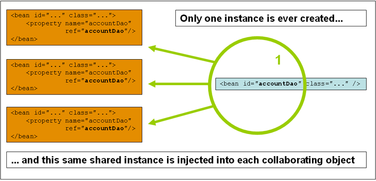
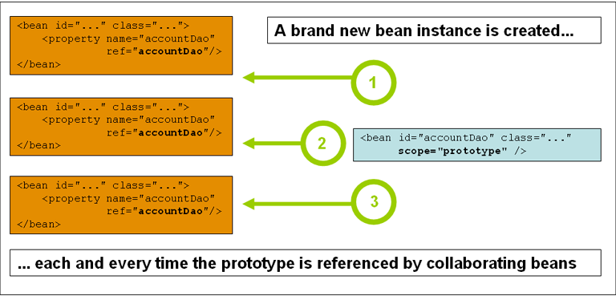

# spring

测试git= =。

# 核心技术

## 1.IOC(inversion of Control,控制反转)

> IOC也被称为依赖注入。
>
> IoC is also known as dependency injection(DI).

这是一个对象仅通过构造器参数，工厂方法的参数，或者是在构造之后/从工厂方法返回之后设置在对象实例上的属性来定义他们的依赖关系。然后`IoC容器`会在创建`bean`的时候注入这些依赖。这个过程是完全反转过来的，`bean`自己控制实例化或者或者通过构造器直接构造/通过`Service Locator`模式机制来控制依赖的位置。

`org.springframework.beans`和`org.springframework.context`这两个包是`IoC容器`的基础。`BeanFactory`接口提供了高级配置机制，能够管理任何类型的对象。`ApplicationContext`是`BeanFactory`的子接口，它添加了：

- 更简单的`AOP`特性的整合。
- 消息（`Message`）资源处理（用于国际化？）
- 事务（`Event`）发布？（`publication`）
- 应用层（`Application-layer`）指定的上下文？(`contexts`)：如，`WebApplicationContext`用于`web`应用。

简而言之，`BeanFactory`提供了配置框架和基础功能，`ApplicationContext`添加了更多企业专用的功能。`ApplicationContext`是一个`BeanFactory`的超集（`complete superset`），并且在这章唯一的用来描述`Sping`的`IoC`容器。[BeanFactory](https://docs.spring.io/spring-framework/docs/current/reference/html/core.html#beans-beanfactory)。

（`bean`的定义）：在`spring`中，形成应用主干的对象和由`Spring IoC`容器管理的对象称为`Beans`。一个`Bean`是一个被`IoC容器`实例化，组装和管理的对象。否则，`bean`就仅仅是应用的许多对象之一。`Beans`和他们之间的依赖，反映在容器使用的配置元数据（`metadata`）中。

### 1.2容器概览

`org.springframework.context.ApplicationContext`接口代表了`Spring IoC容器`，并且负责实例化，配置和组装`beans`。容器通过已经准备好的配置元数据来获得如何实例化，配置和组装`beans`的指导。配置元数据在`XML`，`java`注解或者`java`代码中。它（配置元数据）让你表达你应用中的对象，和他们之间的相互依赖。

`Spring`提供了几种`ApplicationContext`接口的实现。在独立应用中，通常会创建`ClassPathXmlApplicationContext`或者`FileSystemXmlApplicationContext`。由于`XML`是传统的定义配置元数据的格式，你可以通过提供`XML`配置来指导容器显示的声明支持`java`注解或者代码这些额外的元数据格式。

在大多数应用场景，实例化`IoC`容器的一个或多个实例不需要显示用户代码。（？）例如，在一个`web`应用的场景，应用中的`web.xml`文件中一个简单的八行模板`web`描述器`XML`就足够了。如果你在`Eclipse`中使用，你可以使用几下鼠标或者键盘点击就可以完成模板的配置。

下图展示了一个`Spring`如工作原理的高级别的视图。你应用的类由配置元数据组合，在`ApplicationContext`被创建和初始化之后，你就有一个完全配置好的并且可执行的系统或者应用。


#### 1.2.1 配置元数据

就如前面的图展示的那样，`Spring IoC`容器使用格式化的配置元数据。这个配置元数据代表了你作为应用开发者，告诉`Spring`容器去实例化，配置和组装你应用中的对象。

配置元数据由传统的简单的`XML`格式提供，这在这章节中被用来传递`IoC`容器的概念和特点。

> 基于`XML`的元数据不是唯一允许的格式。`IoC`容器本身和元数据格式完全解耦。

可以使用其他的配置元数据：

- [基于注解的配置](https://docs.spring.io/spring-framework/docs/current/reference/html/core.html#beans-annotation-config)：`Spring2.5`开始
- [基于java的配置](https://docs.spring.io/spring-framework/docs/current/reference/html/core.html#beans-java)：`Spring3.0`开始

`Spring`配置组成至少一个并且通常多于一个容器必须管理的`bean`的定义。`XML`配置元数据配置这些`beans`作为在顶级元素为`<beans/>`的元素中配置`<bean/>`元素。`Java`配置通常在一个`@configuration`类中使用`@Bean`注解来配置。

这些`bean`的定义和组成应用的实际对象相对应。通常，你定义服务层（`service layer`）对象，数据获取对象（`data access objects,DAOs`），展示如`Struts`的`Action`实例对象，框架对象（如，`Hibernate`的`SessionFactories`对象，`JMS Queues`和其他的）。通常，不会在容器中配置细粒度领域对象（`fine-grained domain objects`），因为通常这是`DAOs`的责任和业务逻辑来创建和加载领域对象。（<span style="color:red">什么是领域对象</span>）然而，你可以使用`AspectJ`在`IoC`容器的控制之外配置对象。

如图是基于`XML`的配置元数据的基础结构：

```xml
<?xml version="1.0" encoding="UTF-8"?>
<beans xmlns="http://www.springframework.org/schema/beans"
    xmlns:xsi="http://www.w3.org/2001/XMLSchema-instance"
    xsi:schemaLocation="http://www.springframework.org/schema/beans
        https://www.springframework.org/schema/beans/spring-beans.xsd">

    <bean id="..." class="...">  
        <!-- collaborators and configuration for this bean go here -->
    </bean>

    <bean id="..." class="...">
        <!-- collaborators and configuration for this bean go here -->
    </bean>

    <!-- more bean definitions go here -->

</beans>
```

其中，

- `id`属性是一个标识`bean`的字符串（唯一？）
- `class`定义了`bean`的类型，使用全限定名。

#### 1.2.2 实例化一个容器

**java**：

```java
ApplicationContext context = new ClassPathXmlApplicationContext("services.xml", "daos.xml");
```

如下是`services.xml`：

```xml
<?xml version="1.0" encoding="UTF-8"?>
<beans xmlns="http://www.springframework.org/schema/beans"
    xmlns:xsi="http://www.w3.org/2001/XMLSchema-instance"
    xsi:schemaLocation="http://www.springframework.org/schema/beans
        https://www.springframework.org/schema/beans/spring-beans.xsd">

    <!-- services -->

    <bean id="petStore" class="org.springframework.samples.jpetstore.services.PetStoreServiceImpl">
        <property name="accountDao" ref="accountDao"/>
        <property name="itemDao" ref="itemDao"/>
        <!-- additional collaborators and configuration for this bean go here -->
    </bean>

    <!-- more bean definitions for services go here -->

</beans>
```

`daos.xml`：

```xml
<?xml version="1.0" encoding="UTF-8"?>
<beans xmlns="http://www.springframework.org/schema/beans"
    xmlns:xsi="http://www.w3.org/2001/XMLSchema-instance"
    xsi:schemaLocation="http://www.springframework.org/schema/beans
        https://www.springframework.org/schema/beans/spring-beans.xsd">

    <bean id="accountDao"
        class="org.springframework.samples.jpetstore.dao.jpa.JpaAccountDao">
        <!-- additional collaborators and configuration for this bean go here -->
    </bean>

    <bean id="itemDao" class="org.springframework.samples.jpetstore.dao.jpa.JpaItemDao">
        <!-- additional collaborators and configuration for this bean go here -->
    </bean>

    <!-- more bean definitions for data access objects go here -->

</beans>
```

在上面的例子中，服务层由`PetStoreServiceImpl`类和两个数据访问对象，类型为`JpaAccountDao`和`JpaItemDao`（基于`JPA`对象映相关的映射标准）。`property name`元素指的是`JavaBean`的名字属性，`ref`元素指的是另一个`bean`定义的名字。`id`和`ref`元素的联系表达了合作对象之间的依赖关系。更多细节参考[Dependencies](https://docs.spring.io/spring-framework/docs/current/reference/html/core.html#beans-dependencies)。

**写基于XML的配置元数据**：

让`bean`的定义跨越多个`XML`文件可能很有用。通常，每个独立的`XML`配置文件代表你应用的架构中的一个逻辑层或者模型。

你可以使用应用上下文构造器（`application context constructor`）从所有的这些`XML`碎片中加载一个`bean`的定义。这个构造器使用多个`Resource`位置，在`previous section`展示的那样。可以使用`<import/>`标签从其他文件中读取`bean`的定义。

```xml
<beans>
    <import resource="services.xml"/>
    <import resource="resources/messageSource.xml"/>
    <import resource="/resources/themeSource.xml"/>

    <bean id="bean1" class="..."/>
    <bean id="bean2" class="..."/>
</beans>
```

在上面的这个例子中，额外的`bean`定义从`import`指定的三个文件中读取。所有的定位路径都和执行`import`的文件位置相关，所以`services.xml`必须在同一个文件夹下。

> 可以引用父文件夹下的文件，但不推荐。最好使用相对路径，不要使用绝对路径，以免将路径和程序耦合起来。

**使用Groovy来定义Bean，使用DSL**

略。todo

#### 1.2.3使用IoC容器

`ApplicationContext`是工厂的接口，可以用来维护不同`bean`的注册和他们的依赖。通过使用方法`T getBean(String name, Class<T> requiredType)`，你可以获得`bean`的实例。

`ApplicationContext`让你可以读取`bean`的定义，和访问他们，如：

**java**：

```java
// create and configure beans
ApplicationContext context = new ClassPathXmlApplicationContext("services.xml", "daos.xml");

// retrieve configured instance
PetStoreService service = context.getBean("petStore", PetStoreService.class);

// use configured instance
List<String> userList = service.getUsernameList();//这个方法是啥？
```

**kotlin**

略。todo

使用`Groovy`配置的类似，略有区别，略。

最随意的变量是`GenericApplicationContext`，和读取器代表组合在一起——例如：为`XML`文件使用`XmlBeanDefinitionReader`：

```java
GenericApplicationContext context = new GenericApplicationContext();
new XmlBeanDefinitionReader(context).loadBeanDefinitions("services.xml", "daos.xml");
context.refresh();
```

`Groovy`和`Kotlin`的省略。

你可以混合这些读取器代表在同一个`ApplicationContext`上，读取`bean`的定义从不同的配置源。

你可以使用`getBean()`来获取`bean`的实例。`ApplicationContext`有一些其他接口来获取`bean`。但是，理论上， 你应用的代码永远都不应该使用他们。 事实上，你应用的代码应该不调用`getBean()`方法，因此完全不会依赖`Spring API`.?

### 1.3 Bean 概览

`Spring`的`Ioc`容器管理一个或多个`bean`。这些`bean`由你提供给容器的配置元数据创建。

在容器内部，这些`bean`的定义由`BeanDefinition`对象代表，这个对象包含如下的元数据：

- 包限定的类名：通常是`bean`被定义的实际实现类型。
- `bean`的行为配置元素，这些描述了`bean`应该在容器中如何表现（`scope,lifecycle,callbacks`等）
- 其他`bean`的引用。这些引用也被称为`collaboratiors`或者依赖。
- 其他配置设置来设置新创建的对象，如池的大小限制，或者管理连接池的`bean`中连接的数量。

下列是`bean`的属性：解释都在其他连接中，懒得复制了。看到了再说。

| 属性                     | 解释 |
| ------------------------ | ---- |
| Class                    |      |
| Name                     |      |
| Scope                    |      |
| Constructor arguments    |      |
| Properties               |      |
| Autowiring mode          |      |
| Lazy initialization mode |      |
| Initailization method    |      |
| Destruction method       |      |

由于某种原因，允许在容器之外创建对象。者通过访问`ApplicationContext`的`BeanFactory`通过`getBeanFactory()`方法来实现，这个方法会返回`BeanFactory`的`DefaultListableBeanFactory`实现。`DefaultListableBeanFactory`支持通过`registerSingleton(..)`和`registerBeanDefinition(..)`方法来注册。然而，通常用元数据来创建对象。

#### 1.3.1Naming Beans

每个`bean`有一个或多个标识符。标识符必须唯一（`unique`）。通常标识符只有一个。然而，如果要求多个，其他的标识符也可以考虑成为联合标识符（`aliases`）。

在基于`XMl`的配置元数据中，可以使用`id`，`name`来作为标识符。可以在`name`中指定多个标识符，通过`,`或者`;`或者空格分割。`id`必须唯一。

如果不显式提供`id`和`name`，容器会自动生成。然而，如果你想定位或者引用这个`bean`，你必须给他一个`name`。

**在bean定义之外添加别名**

别名的格式：

```xml
<alias name="fromName" alias="toName"/>
```

这种情况下，叫做`fromName`的`bean`也可以通过`toName`来引用。

**例子**：

子系统`A`或许参考一个叫做`subsystemA-dataSource`的数据源，子系统`B`可能参考叫做`subsystemB-dataSource`的数据源。当组合成主应用的时候，会用到这两个子系统，主应用也许参考叫做`myApp-dataSource`的数据源。为了让这三个名字指向同一个对象，你可以添加如下的别名定义到配置元数据中（`XML`）中。

```xml
<alias name="myApp-dataSource" alias="subsystemA-dataSource"/>
<alias name="myApp-dataSource" alias="subsystemB-dataSource"/>
```

这样主应用和其他子系统就可以通过唯一的名称引用数据源，并且保证不会造成任何冲突，但实际上他们使用的是同一个`bean`。

#### 1.3.2 实例化 Beans

`bean`的定义对于创建一个或多个对象是很重要的。容器在被要求和使用由`bean`定义封装的配置元数据来创建实际对象的时候会查看命名`bean`的定义（`recipe`？配方？）

使用`XML`配置的时候，可以使用`<bean/>`中的`class`属性来指定你要实例化对象的类型/类。通常`class`属性在`bean`定义中是强制性的。可以以以下的方式使用`class`属性：

- 通常，指定被构建的`bean`的`class`，在容器通过（反射）调用它的构造器直接创建`bean`，和`java`代码直接使用`new`操作符创建是等效的。
- 在更少出现的容器调用<span style="color:red">静态工厂方法</span>（`static factory method`）来创建一个`bean`的情况下，可以通过指定被调用来创建对象的静态工厂方法中的实际`class`来实现。从静态工厂方法返回的对象类型可能是相同的`class`或者是完全另一个`class`。

**内部类**：`nested class`。

内部类的类名：

给内部类的`class`属性赋值的时候，可以使用`binary name`或者`source name`。

例如，类`SomeThing`在`com.example`包下，由一个静态内部类叫做`OtherThing`，可以使用`$`或者`.`来分割。所以`class`的值可以是：`com.example.SomeThing$OtherThing`或者`com.example.SomeThing.OtherThing`。

**使用构造器实例化**：

使用构造器方法创建`bean`的时候，所有的普通类都可以被`Spring`使用和兼容。这是说，这个类无需实现任何特殊的接口，或者以指定的格式写代码。只需要简单的指定`bean`的类就可以。然而，取决于不同的`IoC`，你可能需要默认的空（无参）构造器。

`Spring IoC`实际上可以管理任何你想让他管理的类。并不限制于管理真正的`JavaBean`。大多数的`Spring`用户倾向于管理拥有空参的默认构造器和对应的`setter`和`getter`的真正的`JavaBean`。（大概是倾向于使用空参构造器构造，然后使用`set`和`get`方法来设置属性）。但你也可以用容器来管理更多非`bean`格式的类。比如，可以管理不是普通的`JavaBean`的`legacy`连接池。

使用`XML`定义`bean`：

```xml
<bean id="exampleBean" class="examples.ExampleBean"/>
<bean name="anotherExample" class="examples.ExampleBeanTwo"/>
```

可以在[依赖注入](https://docs.spring.io/spring-framework/docs/current/reference/html/core.html#beans-factory-collaborators)中查看具体的对象实例化属性设置。

**使用静态工厂方法来实例化**：

当定义一个你用静态工厂方法创建的`bean`的时候，使用`class`属性来指定包含在静态工厂方法中的类，和叫做`factory-method`的属性来指定工厂方法本身。你应该可以调用这个方法并且返回一个存活的对象，你可以像对待通过构造器创建的对象那样对待这个对象。

下列`bean`定义指定了一个被工厂方法创建的`bean`。定义不指定类型或者返回的对象，只有工厂方法的类。在这个例子中，`createInstance()`方法必须是一个<span style="color:red">静态方法</span>。

```xml
<bean id="cliendService" class="examples.ClientService" factory-method="createinstance"/>
```

对应的类：

```java
public class ClientService{//这是一个静态工厂类
    private static ClientService clientService = new ClientService();
    private ClientService(){}
    
    public static ClientService createInstance(){
        return clientService;
    }
}
```

[依赖和细节配置](https://docs.spring.io/spring-framework/docs/current/reference/html/core.html#beans-factory-properties-detailed)。

**通过使用一个实例工厂方法来初始化**：

和使用静态工厂方法实力化类似，使用实例工厂方法调用一个已经存在的`bean`的非静态方法来创建一个新的`bean`。使用这个机制，`class`属性不填，在`factory-bean`属性中，指定一个已经在容器中存在，并且将调用它的方法来创建一个新`bean`的`bean`的名字。使用`factory-method`来指定工厂的方法。如：

```xml
<!-- the factory bean, which contains a method called createInstance() -->
<bean id="serviceLocator" class="examples.DefaultServiceLocator">
    <!-- inject any dependencies required by this locator bean -->
</bean>

<!-- the bean to be created via the factory bean -->
<bean id="clientService"
    factory-bean="serviceLocator"
    factory-method="createClientServiceInstance"/>
```

对应的工厂类：

```java
public class DefaultServiceLocator {

    private static ClientService clientService = new ClientServiceImpl();

    public ClientService createClientServiceInstance() {
        return clientService;
    }
}
```

工厂类也可以有多个`"getInstance()"`方法：

```xml
<bean id="serviceLocator" class="examples.DefaultServiceLocator">
    <!-- inject any dependencies required by this locator bean -->
</bean>

<bean id="clientService"
    factory-bean="serviceLocator"
    factory-method="createClientServiceInstance"/>

<bean id="accountService"
    factory-bean="serviceLocator"
    factory-method="createAccountServiceInstance"/>
```

对应的工厂类：

```java
public class DefaultServiceLocator {

    private static ClientService clientService = new ClientServiceImpl();

    private static AccountService accountService = new AccountServiceImpl();

    public ClientService createClientServiceInstance() {
        return clientService;
    }

    public AccountService createAccountServiceInstance() {
        return accountService;
    }
}
```

`factory bean`指的是在容器中配置，并且可以通过实例或者静态工厂方法来创建对象的`bean`。同时，需要注意`FactoryBean`特指`Spring`中实现的类。

**决定一个`bean`的运行时类型**：

推荐查明一个`bean`的运行时类型的方式是`BeanFactory.getType`，调用指定一个`bean`的名字。

### 1.4 依赖

#### 1.4.1 依赖注入

依赖注入是一个`process`，对象通过构造器参数，工厂方法的参数，或者在对象通过构造器或者从工厂方法返回之后设置的属性来定义他们的依赖（依赖是指，他们一起工作的其他对象）。容器在创建这些`bean`的时候注入这些依赖。这个过程是`bean`自己控制实例化或者通过类的直接构造/服务定位模式来定位它的依赖的过程的，完全反转。

拥有`DI`（依赖注入）的代码更加简洁，并且在对象提供他们依赖的时候更有效地解耦。对象不会寻找它的依赖，并且不知道位置或者依赖的类型（`class`）。因此你的类更容易测试，尤其是依赖在接口或者抽象基类，这些允许`stub`或者单元测试。

依赖注入有两种方式：

- [基于构造器的依赖注入](https://docs.spring.io/spring-framework/docs/current/reference/html/core.html#beans-constructor-injection)
- [基于`setter`的依赖注入](https://docs.spring.io/spring-framework/docs/current/reference/html/core.html#beans-setter-injection)

**基于构造器的依赖注入**：

基于构造器的依赖注入通过容器调用带有一系列参数的构造器来完成任务，每个（参数）代表着一个依赖。调用带有指定参数的静态工厂方法来构造`bean`是几乎等价于，并且这个`discussion`对待给构造器的参数和给静态工厂方法的参数是相似的。如下展示了一个只能用构造器注入的类：

```java
public class SimpleMovieLister {

    // the SimpleMovieLister has a dependency on a MovieFinder
    private final MovieFinder movieFinder;

    // a constructor so that the Spring container can inject a MovieFinder
    public SimpleMovieLister(MovieFinder movieFinder) {
        this.movieFinder = movieFinder;
    }

    // business logic that actually uses the injected MovieFinder is omitted...
}
```

**构造函数参数解析**:

构造器参数解析匹配通过使用参数类型发生。如果`bean`定义的构造器参数中没有可能模棱两可的参数存在，那么在`bean`定义中定义构造函数参数的顺序，就是在实例化`bean`时候将这些参数提供给相应构造函数的顺序。考虑下面的类：

```java
package x.y;

public class ThingOne {

    public ThingOne(ThingTwo thingTwo, ThingThree thingThree) {
        // ...
    }
}
```

假设`ThingTwo`和`ThingThree`没有继承关系，没有可能的模糊性存在。因此，下列的配置是正确的，你也不需要在`<constructor-arg>`元素中显示的指定构造器参数的下标或者类型。

```xml
<beans>
    <bean id="beanOne" class="x.y.ThingOne">
        <constructor-arg ref="beanTwo"/> <!--构造器参数-->
        <constructor-arg ref="beanThree"/>
    </bean>

    <bean id="beanTwo" class="x.y.ThingTwo"/>

    <bean id="beanThree" class="x.y.ThingThree"/>
</beans>
```

当另一个类型位置的类被引用的时候，并且匹配可能发生。当使用一个简单类型的时候，例如`<value>true</value>`，`Spring`不能确定值的类型，并且不能在没有帮助下完成类型的匹配。考虑如下的类：

```java
package examples;

public class ExampleBean {

    // Number of years to calculate the Ultimate Answer
    private final int years;

    // The Answer to Life, the Universe, and Everything
    private final String ultimateAnswer;

    public ExampleBean(int years, String ultimateAnswer) {
        this.years = years;
        this.ultimateAnswer = ultimateAnswer;
    }
}
```

**构造器参数类型匹配**：

在上面的情况下，容器可以使用简单类型的类型匹配，如果通过`type`属性显示指定了构造器参数的类型。

```xml
<bean id="exampleBean" class="examples.ExampleBean">
    <constructor-arg type="int" value="7500000"/>
    <constructor-arg type="java.lang.String" value="42"/><!--使用type显示指定类型才能够匹配-->
</bean>
```

可以通过指定下标（`index`）来解决有两个相同类型的参数的问题。

> `index`从0开始

**构造器参数名字**：

你可以使用构造器参数的名字来解决模糊问题，如下：

```xml
<bean id="exampleBean" class="examples.ExampleBean">
	<constructor-arg name="years" value="75000000"/>
    <constructor-arg name="ultimateAnswer" value="42"/> <!--指定名字-->
</bean>
```

要确保构造器参数设置`name`能够成功必须保证`Spring`可以从构造器查看参数名字（必须有调试标志`debug flag`）。如果不能或者不想使用调试标志编译，可以使用`@ConstructorProperties`注解。

```java
package examples;

public class ExampleBean {

    // Fields omitted

    @ConstructorProperties({"years", "ultimateAnswer"})
    public ExampleBean(int years, String ultimateAnswer) {
        this.years = years;
        this.ultimateAnswer = ultimateAnswer;
    }
}
```

**基于`setter`的依赖注入**：

基于`setter`的依赖注入是容器通过在调用了无参构造器或者午餐静态工厂方法来实例化`bean`之后，调用`bean`的`setter`方法来实现的。

下面展示了只能使用纯净的`setter`注入来完成`DI`。这个类是传统`java`类。

```java
public class SimpleMovieLister {

    // the SimpleMovieLister has a dependency on the MovieFinder
    private MovieFinder movieFinder;

    // a setter method so that the Spring container can inject a MovieFinder
    public void setMovieFinder(MovieFinder movieFinder) {
        this.movieFinder = movieFinder;
    }

    // business logic that actually uses the injected MovieFinder is omitted...
}
```

`ApplicationContext`支持基于构造器和基于`setter`的`DI`。也支持在使用构造器方法注入一部分依赖之后，使用`setter`继续注入其他依赖。在`BeanDefinition`的格式中配置依赖，你和`PropertyEditor`实例一起使用，将属性从一种格式转换为另一种格式。然而，大多数`Spring`用户不直接使用这些类，而是使用基于`XML`的`bean`定义，注解内容（`@Component`，`@Controller`等）或者基于`java`的`@Configuration`类中的`@Bean`方法。这些源会在内部转换成`BeanDefinition`实例，并且被用来加载整个`Spring IoC`容器实例。

> 推荐使用基于构造器的方法注入强制性依赖，使用基于`setter`的方法来注入可选依赖。

**<span style="color:red">依赖解析程序</span>**：

容器执行`bean`依赖解析过程如下：

- `ApplicationContext`被创建并且使用配置元数据初始化。配置元数据可以由`XML`，`java`代码或者注解指定。
- 对于每一个`bean`，他的依赖通过属性，构造器参数，或者静态工厂方法参数来表达。这些依赖会被提供给`bean`，当`bean`被真正创建的时候。
- 每一个属性或者构造器参数是值或者集合的实际定义，或者指向容器中其他`bean`的指针。
- 作为值的每个属性或者构造器参数都将从其指定格式转换为该属性或构造函数参参数的实际类型。默认的，`Spring`可以将字符格式的值转换到内置类型，例如`int，long，String，boolean`等。

`Spring`容器在被创建的时候就会验证每个`bean`的配置。然而，`bean`属性在它实际被创建之前都不会被设置。单例模式的`bean`和预实例化（`pre-instantiated`，默认的方式）将在容器被创建的时候就创建。否则，`bean`仅仅在被请求的时候才会创建。`bean`的创建可能会导致`bean`图的创建，因为`bean`的依赖，和它依赖的依赖...会被创建并且赋值。注意，依赖之中的解析误匹配可能会延迟显现。

> 循环依赖：在构造器注入依赖中，A依赖B，B依赖A，会在运行的时候抛出`BeanCurrentlyIn CreationException`。可能的解决办法是，将一个依赖的注入，改为使用`setter`注入。	

`Spring`会尽可能推迟解析依赖，到`bean`实际创建的时候。但这样会导致配置错误延迟出现。解决办法是预实例化或者单例模式，但是这样会提前占用一些内存？

如果没有循环依赖，被依赖的`bean`会在依赖`bean`的`setter`之前就完全配置好。（`A`依赖`B`，则`B`会先于`A`完全配置好）。

**DI的例子**：

***基于`setter`的方式***：

```xml
<bean id="exampleBean" class="examples.ExampleBean">
    <!-- setter injection using the nested ref element -->
    <property name="beanOne">
        <ref bean="anotherExampleBean"/>
    </property>

    <!-- setter injection using the neater ref attribute -->
    <property name="beanTwo" ref="yetAnotherBean"/>
    <property name="integerProperty" value="1"/>
</bean>

<bean id="anotherExampleBean" class="examples.AnotherBean"/>
<bean id="yetAnotherBean" class="examples.YetAnotherBean"/>
```

`ExampleBean`类：

```java
public class ExampleBean {

    private AnotherBean beanOne;

    private YetAnotherBean beanTwo;

    private int i;

    public void setBeanOne(AnotherBean beanOne) {
        this.beanOne = beanOne;
    }

    public void setBeanTwo(YetAnotherBean beanTwo) {
        this.beanTwo = beanTwo;
    }

    public void setIntegerProperty(int i) {
        this.i = i;
    }
}
```

***基于构造器的方式：***

```xml
<bean id="exampleBean" class="examples.ExampleBean">
    <!-- constructor injection using the nested ref element -->
    <constructor-arg>
        <ref bean="anotherExampleBean"/>
    </constructor-arg>

    <!-- constructor injection using the neater ref attribute -->
    <constructor-arg ref="yetAnotherBean"/>

    <constructor-arg type="int" value="1"/> 
    <!--区别就在于这里使用constructor-arg，而上面使用property-->
</bean>

<bean id="anotherExampleBean" class="examples.AnotherBean"/>
<bean id="yetAnotherBean" class="examples.YetAnotherBean"/>
```

`ExampleBean`类：

```java
public class ExampleBean {

    private AnotherBean beanOne;

    private YetAnotherBean beanTwo;

    private int i;

    public ExampleBean(
        AnotherBean anotherBean, YetAnotherBean yetAnotherBean, int i) {
        this.beanOne = anotherBean;
        this.beanTwo = yetAnotherBean;
        this.i = i;
    }
}
```

***基于静态工厂类方法的方式***：

```xml
<bean id="exampleBean" class="examples.ExampleBean" factory-method="createInstance">
    <constructor-arg ref="anotherExampleBean"/>
    <constructor-arg ref="yetAnotherBean"/>
    <constructor-arg value="1"/>
</bean>

<bean id="anotherExampleBean" class="examples.AnotherBean"/>
<bean id="yetAnotherBean" class="examples.YetAnotherBean"/>
```

`ExampleBean`类：

```java
public class ExampleBean {

    // a private constructor
    private ExampleBean(...) {
        ...
    }

    // a static factory method; the arguments to this method can be
    // considered the dependencies of the bean that is returned,
    // regardless of how those arguments are actually used.
    public static ExampleBean createInstance (
        AnotherBean anotherBean, YetAnotherBean yetAnotherBean, int i) {

        ExampleBean eb = new ExampleBean (...);
        // some other operations...
        return eb;
    }
}
```

#### 1.4.2 配置和依赖的细节

**String值**：

`<property/>`中的`value`属性可以指定一个属性或者构造器参数以人类可读的字符串的格式。`conversion service`用来将字符串类型转换成其他属性的实际类型。

```xml
<bean id="myDataSource" class="org.apache.commons.dbcp.BasicDataSource" destroy-method="close">
        <!-- results in a setDriverClassName(String) call -->
    <property name="driverClassName" value="com.mysql.jdbc.Driver"/>
    <property name="url" value="jdbc:mysql://localhost:3306/mydb"/>
    <property name="username" value="root"/>
    <property name="password" value="misterkaoli"/>
</bean>
```

下面的例子使用了`p-namespace`：

```xml
<beans xmlns="http://www.springframework.org/schema/beans"
    xmlns:xsi="http://www.w3.org/2001/XMLSchema-instance"
    xmlns:p="http://www.springframework.org/schema/p"
    xsi:schemaLocation="http://www.springframework.org/schema/beans
    https://www.springframework.org/schema/beans/spring-beans.xsd">

    <bean id="myDataSource" class="org.apache.commons.dbcp.BasicDataSource"
        destroy-method="close"
        p:driverClassName="com.mysql.jdbc.Driver"
        p:url="jdbc:mysql://localhost:3306/mydb"
        p:username="root"
        p:password="misterkaoli"/>
    <!-- 直接在内部使用p:属性名来指定各个属性-->

</beans>
```

上面的`XML`很简洁，但是类型检查会在运行时才执行，除非你使用某些`IDE`。

也可以配置`java.util.Properties`实例：

```xml
<bean id="mappings"
    class="org.springframework.context.support.PropertySourcesPlaceholderConfigurer">

    <!-- typed as a java.util.Properties -->
    <property name="properties">
        <value> <!-- 大概是key=value的方式？-->
            jdbc.driver.className=com.mysql.jdbc.Driver
            jdbc.url=jdbc:mysql://localhost:3306/mydb
        </value>
    </property>
</bean>
```

`Spring`容器会将`<value>`中的文本通过使用`JavaBean`的`PropertyEditor`机制转换为`java.util.Properties`的实例。似乎是`Spring`团队更喜欢也更推荐的方式？

**idref元素**：

`idref`元素是一个防错的方式将容器中另一个`bean`的`id`而非引用传递给一个`<constructor-arg>`或者`<property>`元素。如下：

```xml
<bean id="theTargetBean" class="..."/>

<bean id="theClientBean" class="...">
    <property name="targetName">
        <idref bean="theTargetBean"/>
        <!-- 正常的引用似乎也就是<ref bean="theTargetBean"/>?那这样的意义在哪儿呢？防错防了个啥？-->
        <!-- 似乎不太对，ref和idref不是同一类东西？下面的等价方法不太一样。-->
    </property>
</bean>
```

等价的格式（运行时等价）：

```xml
<bean id="theTargetBean" class="..." />

<bean id="client" class="...">
    <property name="targetName" value="theTargetBean"/>
</bean>
```

第一种方式更为推荐，因为可以让容器可以在<span style="color:red">部署的时候</span>就验证命名`bean`是否存在。第二种只能在实际构造的时候才能够发现问题——问题延迟显现。

**引用其他bean**：

`ref`元素是在`<constructor-arg>`或`<property>`中最后的元素。

```xml
<ref bean="someBean"/>
```

可以通过`parent`属性来创建一个指向存在于父容器中的`bean`。目标`bean`必须在父容器或者当前容器中。

父`xml`:

```xml
<!-- in the parent context -->
<bean id="accountService" class="com.something.SimpleAccountService">
    <!-- insert dependencies as required here -->
</bean>
```

子`xml`：

```xml
<!-- in the child (descendant) context -->
<bean id="accountService" <!-- bean name is the same as the parent bean -->
    class="org.springframework.aop.framework.ProxyFactoryBean">
    <property name="target">
        <ref parent="accountService"/> <!-- notice how we refer to the parent bean -->
    </property>
    <!-- insert other configuration and dependencies as required here -->
</bean>
```

**内部bean**：

在`<property>`或者`<constructor-arg>`中定义的`<bean>`元素就是内部`bean`。

```xml
<bean id="outer" class="...">
    <!-- instead of using a reference to a target bean, simply define the target bean inline -->
    <property name="target">
        <bean class="com.example.Person"> <!-- this is the inner bean -->
            <property name="name" value="Fiona Apple"/>
            <property name="age" value="25"/>
        </bean>
    </property>
</bean>
```

内部`bean`不要求指定`id`或者`name`。即使指定了，也不会被当作标识符。不可能单独访问或者将内部`bean`注入到其他`bean`中， 所以不要求。

**集合**：

`<list>`，`<set>`，`<map>`和`<props>`元素设置了集合和列表类型的属性或参数（`props`似乎是`properties`）。

```xml
<bean id="moreComplexObject" class="example.ComplexObject">
    <!-- results in a setAdminEmails(java.util.Properties) call -->
    <property name="adminEmails">
        <props>
            <prop key="administrator">administrator@example.org</prop>
            <prop key="support">support@example.org</prop>
            <prop key="development">development@example.org</prop>
        </props>
    </property>
    <!-- results in a setSomeList(java.util.List) call -->
    <property name="someList">
        <list>
            <value>a list element followed by a reference</value>
            <ref bean="myDataSource" />
        </list>
    </property>
    <!-- results in a setSomeMap(java.util.Map) call -->
    <property name="someMap">
        <map>
            <entry key="an entry" value="just some string"/>
            <entry key="a ref" value-ref="myDataSource"/>
        </map>
    </property>
    <!-- results in a setSomeSet(java.util.Set) call -->
    <property name="someSet">
        <set>
            <value>just some string</value>
            <ref bean="myDataSource" />
        </set>
    </property>
</bean>
```

**集合合并**：

`Spring`容器支持集合合并。可以定义一个父`<list>,<map>,<set>,<props>`，然后对应的子元素会继承并`override`从父集合继承来的值。子集合是父集合和子集合合并的结果。

```xml
<beans>
    <bean id="parent" abstract="true" class="example.ComplexObject">
        <property name="adminEmails">
            <props>
                <prop key="administrator">administrator@example.com</prop>
                <prop key="support">support@example.com</prop>
            </props>
        </property>
    </bean>
    <bean id="child" parent="parent">
        <property name="adminEmails">
            <!-- the merge is specified on the child collection definition -->
            <props merge="true">
                <prop key="sales">sales@example.com</prop>
                <prop key="support">support@example.co.uk</prop>
            </props>
        </property>
    </bean>
<beans>
```

要注意`merge="true"`的使用：子类的结果：

```
administrator=administrator@example.com // 子类从父类继承
sales=sales@example.com //子类自己定义的
support=support@example.co.uk //子类override了父类的值
```

**集合合并的限制**：

可以融合不同类型的集合，如果你这么做，会抛出对应的异常。

`merger`属性只能在子类上指定，父类上指定，既多余，又没用。

**强类型集合**：

可以限制集合中元素的类型。`Spring`提供一定的类型转换能力，例如从`String`到`float`。

```java
public class SomeClass {

    private Map<String, Float> accounts;

    public void setAccounts(Map<String, Float> accounts) {
        this.accounts = accounts;
    }
}
```

```xml
<beans>
    <bean id="something" class="x.y.SomeClass">
        <property name="accounts">
            <map>
                <entry key="one" value="9.99"/>
                <entry key="two" value="2.75"/>
                <entry key="six" value="3.99"/>
            </map>
        </property>
    </bean>
</beans>
```

如上，`Spring`可以通过反射获取`SomeClass`中的元素类型`Float`，并且自动将字符串类型`"9.99"`转换到`float`类型。

**Null和空字符串值**：

`Spring`将空的属性视为空字符串。

```xml
<bean class="ExampleBean">
	<property name="email" value=""/>
</bean>
```

这等价于`java`代码：

```java
exampleBean.setEmail("");
```

使用`<null/>`标签来设置`null`值。

```xml
<bean class="ExampleBean">
    <property name="email">
        <null/>
    </property>
</bean>
```

这等价于`java`代码：

```java
exampleBean.setEmail(null);
```

**使用p-命名空间的XMl快捷配置**：

`p-命名空间（p-namespace）`能让你使用`bean`元素的属性，而不是`<property/>`元素来描述`bean`的属性值。

`Spring`支持带命名域的可扩展的配置格式，这基于`XML`的`Schema`定义。`p-namespace`并不在`XSD`文件中定义，而是只存在于`Spring`核中。

下面两个`XML`展示了两种不同的配置方式，第一个使用标准`XMl`格式，第二个使用`p-namespace`。

```xml
<beans xmlns="http://www.springframework.org/schema/beans"
    xmlns:xsi="http://www.w3.org/2001/XMLSchema-instance"
    xmlns:p="http://www.springframework.org/schema/p"
    xsi:schemaLocation="http://www.springframework.org/schema/beans
        https://www.springframework.org/schema/beans/spring-beans.xsd">

    <bean name="classic" class="com.example.ExampleBean">
        <property name="email" value="someone@somewhere.com"/>
    </bean>

    <bean name="p-namespace" class="com.example.ExampleBean"
        p:email="someone@somewhere.com"/>
</beans>
```

上面的代码`email`属性使用了`p-namespace`在`bean`的定义中。如前所述，`p-namespace`并没有一个模式定义，所以可以将属性（`attribute`）的名称设置为属性（`property`）的名称。 

另一个例子：

```xml
<beans xmlns="http://www.springframework.org/schema/beans"
    xmlns:xsi="http://www.w3.org/2001/XMLSchema-instance"
    xmlns:p="http://www.springframework.org/schema/p"
    xsi:schemaLocation="http://www.springframework.org/schema/beans
        https://www.springframework.org/schema/beans/spring-beans.xsd">

    <bean name="john-classic" class="com.example.Person">
        <property name="name" value="John Doe"/>
        <property name="spouse" ref="jane"/>
    </bean>

    <bean name="john-modern"
        class="com.example.Person"
        p:name="John Doe"
        p:spouse-ref="jane"/><!--与前面的相比，这里多了个`-ref`-->

    <bean name="jane" class="com.example.Person">
        <property name="name" value="Jane Doe"/>
    </bean>
</beans>
```

这个例子使用了特殊的模式来声明一个引用属性。上面主要想展示的点在于：`<property name="spouse" ref ="jane"/>`和`p:spouse-ref="jane"`来声明同样一个引用。后面的格式中`spouse`代表引用的名字，`-ref`指明了这不是一个普通的直接值，而是一个引用类型。

**使用c-命名空间来快捷配置XML**：

和`p-namespace`类似，它允许内联属性来配置构造器参数，而不是使用内联的`constructor-arg`元素。

下面使用`c:`命名空间来实现和基于构造器的依赖注入一样的事情。

```xml
<beans xmlns="http://www.springframework.org/schema/beans"
    xmlns:xsi="http://www.w3.org/2001/XMLSchema-instance"
    xmlns:c="http://www.springframework.org/schema/c"
    xsi:schemaLocation="http://www.springframework.org/schema/beans
        https://www.springframework.org/schema/beans/spring-beans.xsd">

    <bean id="beanTwo" class="x.y.ThingTwo"/>
    <bean id="beanThree" class="x.y.ThingThree"/>

    <!-- traditional declaration with optional argument names -->
    <bean id="beanOne" class="x.y.ThingOne">
        <constructor-arg name="thingTwo" ref="beanTwo"/>
        <constructor-arg name="thingThree" ref="beanThree"/>
        <constructor-arg name="email" value="something@somewhere.com"/>
    </bean>

    <!-- c-namespace declaration with argument names -->
    <bean id="beanOne" class="x.y.ThingOne" c:thingTwo-ref="beanTwo"
        c:thingThree-ref="beanThree" c:email="something@somewhere.com"/>

</beans>
```

在比较少见的情况下，可能无法获取构造器参数的名字（通常是由于字节码编译的时候没有打开调试信息）可以使用`fallback`到参数的下标：

```xml
<!-- c-namespace index declaration -->
<bean id="beanOne" class="x.y.ThingOne" c:_0-ref="beanTwo" c:_1-ref="beanThree"
    c:_2="something@somewhere.com"/>
```

如上所示，使用`_n`来指定第几个参数。

虽然可以使用`index`来定位参数，但还是推荐使用名字，只在必要的时候使用`index`。

**复合属性名**：

设置`bean`属性的时候可以复合或者内联属性名，只要路径内容中的除了最后一个位置的属性名以外代表的都不是`null`就可以。

```xml
<bean id="something" class="things.ThingOne">
    <property name="fred.bob.sammy" value="123" />
</bean>
```

上面展示的是，`something`有一个`fred`的属性，`fred`又有一个`bob`属性，它有一个`sammy`属性，这个`sammy`属性被设置为`123`。这种情况正常工作的前提是，在构造完之后，`something`的`bob`属性和`fred`属性都必须不是`null`，否则会抛出异常。

#### 1.4.4 使用`depends-on`

如果一个`bean`依赖另一个`bean`，通常意味着一个`bean`会被设置为另一个的属性。在基于`XML`的配置元数据中会使用`<ref/`元素来完成这个操作。然而，有时候两个`bean`之间的依赖没有这么直接。一个例子是，一个类中的静态初始化方法需要出发，例如数据库驱动注册。`depends-on`属性可以显示强制一个或更多`bean`在这个`bean`之前初始化。下面的例子展示了使用`depends-on`属性来表达一个`bean`上的依赖：

```xml
<bean id="beanOne" class="ExampleBean" depends-on="manager"/>
<bean id="manager" class="ManagerBean" />
```

表达多个依赖的时候，可以使用列表的形式来指定多个依赖：

```xml
<bean id="beanOne" class="ExampleBean" depends-on="manager,accountDao">
    <property name="manager" ref="manager" />
</bean>

<bean id="manager" class="ManagerBean" />
<bean id="accountDao" class="x.y.jdbc.JdbcAccountDao" />
```

> 被依赖的类，会在这个类之后才销毁（即销毁的顺序是，beanOne，然后再是depends-on中的，所以denpends-on也可以控制关闭顺序

**懒惰初始化bean**：

默认的，`ApplicationContext`的实现渴望创建和配置`singleton`单例`bean`作为初始化过程中的一部分。这是有设计的，因为这可以让依赖错误更早的暴露出来，而不是延迟显现。但不想这样做的时候，可以将一个单例`bean`设置为`lazy-initializd`来防止提前初始化，这样`IoC`容器会在第一次请求这个`bean`的时候才初始化，而不是在一开始。

```xml
<bean id="lazy" class="com.something.ExpensiveToCreateBean" lazy-init="true"/>
<bean name="not.lazy" class="com.something.AnotherBean"/>
```

如果设置了`lazy-init`的单例`bean`在另一个没有设置的单例`bean`的依赖中，它还是会在开始的时候初始化，这是因为被依赖的`bean`要先于这个`bean`初始化。

可以在容器层面设置`default-lazy-init`，在`<beans/>`中：

```xml
<beans default-lazy-init="true">
    <!-- no beans will be pre-instantiated... -->
</beans>
```

#### 1.4.5 Autowiring Collaborators

`Spring`容器可以在两个合作的`bean`之间自动连线（`autowire`）。可以让`Spring`通过检查`ApplicationContext`中的内容来自动处理合作者。`autowire`有如下好处：

- 自动布线可以有效减少指定属性或者构造器参数的需要。
- 自动布线可以在你的对象发展的时候更新配置。例如，如果你需要添加一个类的依赖，这个依赖可以自动满足而不需要你修改配置。因此自动布线在开发中非常有用，当代码稳定之后，也可以修改到显示的连线中。

使用基于`XML`的配置元数据的时候，你可以为`bean`的定义指定自动布线模式，通过使用`autowire`属性。自动布线功能有四个模式。你可以为每个`bean`指定不限模式。下表描述了四种自动布线模式：

| 模式        | 解释                                                         |
| ----------- | ------------------------------------------------------------ |
| no          | 默认，不自动布线。必须显示的设置引用。对于大规模的部署，不推荐修改默认模式。因为显式指定合作者能提供更大的控制和清晰性。 |
| byName      | 根据属性名自动布线。`Spring`寻找和属性有相同名字的`bean`进行自动连线。例如，如果一个`bean`定义设置通过`name`来自动布线，并且它有一个`master`属性，`Spring`会寻找叫做`master`的`bean`，并设置到属性。 |
| byType      | 如果恰好容器中存在要给`bean`拥有属性中指定的类型，就会被自动连线。如果有超过一个的存在，将会抛出异常，这表明你不能使用`byType`来设置。如果没有能匹配的，什么也不会发生，属性也不会被设置。 |
| constructor | 和`byType`类似，但会申请到构造器参数？（使用构造器中的参数），如果没有存在的`bean`拥有参数的类型，将会报错。 |

**自动布线的限制和缺点**：

略。todo

**从自动连线中排除一个`bean`**：

大概是可以使用参数来让一个`bean`不参与自动布线。

略。todo

#### 1.4.6 注入方法

大多数的应用场景中， 容器中大多数`bean`都是单例模式。当一个单例`bean`和一个单例`bean`合作的时候，或者非单例和非单例合作的时候，可以通过在属性中注入依赖来定义。当`bean`的生命周期不同的时候会有问题。假设一个单例`A`在每一个方法中都会依赖到一个非单例的`B`。容器只会创建单例`A`一次，因此只有一次机会来设置属性。容器不能在需要的时候每次都提供给`A`一个新的`B`的实例。

一个解决办法是放弃一些控制反转。可以通过让`A`实现`ApplicationContextAware`接口来让`A`感知到容器，并且通过实现一个`getBean("B")`在每次需要`B`的新实例的时候请求容器调用。如下代码所示：

```java
// a class that uses a stateful Command-style class to perform some processing
package fiona.apple;

// Spring-API imports
import org.springframework.beans.BeansException;
import org.springframework.context.ApplicationContext;
import org.springframework.context.ApplicationContextAware;

public class CommandManager implements ApplicationContextAware {

    private ApplicationContext applicationContext;

    public Object process(Map commandState) {
        // grab a new instance of the appropriate Command
        Command command = createCommand();
        // set the state on the (hopefully brand new) Command instance
        command.setState(commandState);
        return command.execute();
    }

    protected Command createCommand() {
        // notice the Spring API dependency!
        return this.applicationContext.getBean("command", Command.class);
    }

    public void setApplicationContext(
            ApplicationContext applicationContext) throws BeansException {
        this.applicationContext = applicationContext;
    }
}
```

前面的代码不太可取，因为业务代码知道`Spring`框架，并且与之耦合。方法注入是`Spring IoC`容器的高级特性。

**查找方法注入**：

查找方法注入是容器`override`重写容器管理的`bean`的方法并且返回查找另一个容器中命名`bean`的结果。`Spring`框架通过生成字节码来实现，具体是调用`CGLIB`库来动态的生产重写方法的子类。

略

<span style="color:red">todo：方法注入这部分没看明白，后面有机会再重看吧。</span>

### 1.5 Bean Scopes(范围？限定？)

创建一个`bean`的定义的时候，就创建了一个如何创建这个在`bean`定义中指定的这个类的`recipe`（配方）。（大概就是，创建了一个如何去创建相应对象的方案？指导？）你可以 通过这个`recipe`创建很多个这个`bean`的对象。

你不经可以控制你创建对象的依赖和配置值，你还可以控制它的`scope`范围？作用域？这个方法很强大而且灵活，因为你可以在对象层面而不是`java`类的层面去配置对象的范围。`bean`可以被定义部署在多个`scope`中的一个。`Spring`框架支持6个`scope`，其中四个当你使用`web-aware ApplicatinContext`都可以访问到。也可以创建自定义`scope`。

| scope       | Description                                                  |
| ----------- | ------------------------------------------------------------ |
| singleton   | 默认，为每个`IoC`容器将单个`bean`定义限定为单个对象实例。    |
| prototype   | 将单个`bean`定义的范围限定为任意数量的对象实例。             |
| request     | 将单个`bean`定义的范围限定为一个`HTTP`请求的生命周期。这指的是，每个`HTTP`请求会创建他自己的`bean`实例。这只在`web`可感知的`ApplicationContext`中有效。 |
| session     | 限定到一个`HTTP`会话，同样只在`web`可感知的中有效。          |
| application | 限定到一个`ServletContext`的生命周期。同上。                 |
| websocket   | 限定到一个`WebSocket`的生命周期中。同上。                    |

> 3.0之后支持线程范围` SimpleThreadScope`。

#### 1.5.1 Singleton Scope 单例范围

单例`bean`只有一个共享实例被管理，任何`ID`或者匹配到这个`bean`的定义都会通过容器返回这个特定的实例。

换句话说，当定义一个限定为单例的`bean`，`IoC`容器创建一个对象实例。这个实例会存储在那个单例`bean`的`cache`中，并且所有子请求和引用这个`bean`都会返回缓存中的这个对象。下图展示了单例限定的工作原理：



`Spring`中单例的概念和定义在`Gang of Four（GoF）`中的单例模式不太一样。`GoF`中的单例是硬编码使得只有一个实例被类加载器创建。而`Spring`得单例更应该描述为每个容器对应一个`bean`。（意思是`GoF`的是一个实例/一个类加载器，`Spring`的是一个实例/一个容器，一个实例/一个`bean`。）这意味着，如果你为某个类定义为`Spring`的单例，那么`Spring`容器仅会创建一个这个`bean`定义的实例。在`XML`中定义一个单例`bean`可以如下：

```xml
<bean id="accountService" class="com.something.DefaultAccountService"/>

<!-- the following is equivalent, though redundant (singleton scope is the default) -->
<bean id="accountService" class="com.something.DefaultAccountService" scope="singleton"/>
```

#### 1.5.2 Prototype Scope 原型范围

非单例的原型范围的`bean`部署会导致每次请求这个`bean`都会创建一个新的实例。请求指的是将这个`bean`注入别的`bean`或者通过容器调用`getBean()`方法。作为一条规定，你应该为状态相关的`bean`使用`prototype scope`，为状态无关的`bean`使用`singleton scope`。



数据访问对象`data access object(DAO)`通常不配置为`prototype`，因为典型的`DAO`并不会持有任何状态信息。使用单例能够更好的重用。

用`XML`定义一个`prototype`模式：

```xml
<bean id="accountService" class="com.something.DefaultAccountService" scope="prototype"/>
```

与其他`scope`对比起来，`Spring`不会管理`prototype bean`的完整生命周期。容器实例化，配置，或者？编译一个`prototype`对象，并且把它交给`client`，并且不会继续记录那个原型实例。因此，尽管初始化生命周期回调函数在所有对象上都会调用（无论`scope`），但是在原型实例中，生命周期回调函数并不会调用。<span style="color:red">客户代码必须清理原型范围的对象，并且释放原型`bean`持有的资源</span>。可以使用自定义的`bean`的[post-processer](https://docs.spring.io/spring-framework/docs/current/reference/html/core.html#beans-factory-extension-bpp)来实现资源释放。

在某些方面，`Spring`容器的角色对于原型`bean`来说只是`new`操作符的替代品。

#### 1.5.3 拥有`prototype-bean`依赖的单例`bean`

当你使用有`prototype-bean`依赖的单例`bean`的时候，一定要指导依赖在初始化的时候就解析了。因此，如果你将一个`prototype-bean`的依赖注入到一个单例`bean`中的时候，一个新的`prototype-bean`将会被实例化，并且注入到这个单例`bean`中。

然而，假设你想在运行时给这个单例`bean`重复的请求一个新的这个`prototype-bean`的实例。你不能将一个`prototype-bean`依赖注入到你的单例`bean`中，因为那样的注入只发生一次，也就是在`Spring`容器实例化这个单例`bean`的时候就已经解析并注入了依赖。如果在运行时你需要一个`prototype-bean`超过一次，请看<span style="color:red">方法注入</span>。（也就是1.4.5还是6，我跳过的部分 = =）。

#### 1.5.4请求，会话，应用和WebSocket Scope

这些`Scope`只有在`web`可感知的`ApplicationContext`的实现（例如`XmlWebApplicationContext`）中可以使用。如果你用普通的`Spring IoC`容器来使用这些，会导致`IllegalStateException`抛出。

**初始化Web配置**：

为了支持这些`Scope`，在定义`bean`之前需要设置一些初始配置。（这些配置对于标准`Scope`来说并不要求）。

如何实现初始化安装取决于特定的`Servlet`环境。

如果你在`Spring Web MVC`中访问受限（`Scoped`）的`bean`，在`Spring`的`DispatcherServlet`中被处理的请求，就不需要特殊的初始化配置过程。`DispatcherServlet`已经暴露了相关的状态。

使用不同版本的`Servlet`的容器可能要求不同。对于老一点容器，可能需要如下的配置：`web.xml`

```xml
<web-app>
    ...
    <listener>
        <listener-class>
            org.springframework.web.context.request.RequestContextListener
        </listener-class>
    </listener>
    ...
</web-app>
```

如果这部分有问题，可以考虑使用`Spring`的`RequestContextFilter`。过滤映射取决于`web`应用的环境配置，所以你必须适当的修改它。下列展示了`web`应用的一部分：

```xml
<web-app>
    ...
    <filter>
        <filter-name>requestContextFilter</filter-name>
        <filter-class>org.springframework.web.filter.RequestContextFilter</filter-class>
    </filter>
    <filter-mapping>
        <filter-name>requestContextFilter</filter-name>
        <url-pattern>/*</url-pattern>
    </filter-mapping>
    ...
</web-app>
```

`DispatcherServlet,RequestContextListener,RequestContextFilter`他们其实都做的同样的工作，将`HTTP`请求绑定到对应的处理请求的线程。这让`bean`在请求和会话`scope`中的调用链上能够在更远的位置访问？

**请求（Request）Scope**：

考虑如下的配置：

```xml
<bean id="loginAction" class="com.something.LoginAction" scope="request"/>
```

`Spring`容器会为每一个`HTTP`请求创建这个`loginAction bean`的实例。这是因为`loginAction`被限制在`HTTP`请求的级别。你可以改变创建的这个实例的任何内部状态，因为从同一个`loginAction bean`创建出来的其他实例并不会知晓这些改变。他们参与到独立的请求中。当请求处理完成的时候，这个实例会被丢弃。

当使用注解驱动的内容或者`java`配置的时候，`@RequestScope`注解可以被用来给一个内容设置这个限制。如下；

```java
@RequestScope
@Component
public class LoginAction {
    // ...
}
```

**会话限制**：

```xml
<bean id="userPreferences" class="com.something.UserPreferences" scope="session"/>
```

几乎和`request scope`是一样的，只不过级别变成了`session`。

使用注解：

```java
@SessionScope
@Component
public class UserPreferences {
    // ...
}
```

**应用限制**：

```xml
<bean id="appPreferences" class="com.something.AppPreferences" scope="application"/>
```

`Spring`容器只会会为一个新的`web`应用创建一个新的实例。这个`bean`被限制在`ServletContext`的级别，并且作为`ServletContext`的常规属性存储。这个限制在某种程度上和单例`bean`很像，但有一些区别：

- 这对于`ServletContext`来说是单例的，但不是对于`ApplicationContext`。
- 他会被暴露，并且因此作为`ServletContext`的属性可见。

注解的形式：

```java
@ApplicationScope
@Component
public class AppPreferences {
    // ...
}
```

**将受限的bean作为依赖**：

`IoC`容器不仅管理对象的实例，也会管理依赖。如果你想将`request-scope`的`bean`注入到生命周期更长的`scope`中，你也许应该选择注入一个`AOP`代理的受限的`bean`。就是，你需要注入一个和受限对象有同样的`public`接口的代理对象，同时也可以从相关的`scope`（例如`request scope`）里面获得真实的对象，并将方法调用委托给真实对象。

> `AOP`代理并不是唯一的方式，也可以声明注入点(injection point)，如`ObjectFactory<MyTargetBean>`，允许一个`getObject()`调用来返回当前的实例（在每一次需要的时候，并且不独立持有或存储这个实例？）。

下面的代码很简单，但理解其中的`why`和`how`很重要：

```xml
<?xml version="1.0" encoding="UTF-8"?>
<beans xmlns="http://www.springframework.org/schema/beans"
    xmlns:xsi="http://www.w3.org/2001/XMLSchema-instance"
    xmlns:aop="http://www.springframework.org/schema/aop"
    xsi:schemaLocation="http://www.springframework.org/schema/beans
        https://www.springframework.org/schema/beans/spring-beans.xsd
        http://www.springframework.org/schema/aop
        https://www.springframework.org/schema/aop/spring-aop.xsd">

    <!-- an HTTP Session-scoped bean exposed as a proxy -->
    <bean id="userPreferences" class="com.something.UserPreferences" scope="session">
        <!-- instructs the container to proxy the surrounding bean -->
        <aop:scoped-proxy/> <!-- 在这里使用了aop代理？-->
    </bean>

    <!-- a singleton-scoped bean injected with a proxy to the above bean -->
    <bean id="userService" class="com.something.SimpleUserService">
        <!-- a reference to the proxied userPreferences bean -->
        <property name="userPreferences" ref="userPreferences"/>
        <!-- 注入受限于session的bean，普通的注入方式-->
    </bean>
</beans>
```

为了创建这样的代理，需要插入一个子`<aop:scoped-proxy/>`元素到受限的`bean`中（[选择创建代理的类型](https://docs.spring.io/spring-framework/docs/current/reference/html/core.html#beans-factory-scopes-other-injection-proxies)）为什么`request,session`和自定义的`scope`需要`<aop:scoped-proxy/>`元素？考虑如下的单例定义：

```xml
<bean id="userPreferences" class="com.something.UserPreferences" scope="session"/>

<bean id="userManager" class="com.something.UserManager">
    <property name="userPreferences" ref="userPreferences"/>
</bean>
```

在上面的例子中，单例`bean`中注入了一个`session`受限的`bean`。对于单例来说，默认在容器初始化的时候创建一次，对应的`session`受限的`bean`也只创建一次，并在这时注入。这意味着，单例`bean`始终只操作同一个受限的`bean`对象。（有个问题是，说了在`session`关闭的时候会丢弃，那么丢弃了之后这个就不存在了？似乎按`JVM`来理解，这里添加了依赖，那边断了依赖而已，这边还能够访问到这个`session`受限的对象？）

这并不是当你将一个短生命周期的依赖注入到长生命周期的`bean`中，你想看到的行为。而是，你需要一个单例对象，同时在一个`HTTP`会话的生命周期内，需要一个受限于这个`session`内的对象。（意思就是有新的`session`的时候，应该用一个新的对象，而不是继续使用这个对象，否则`session scope`和没有设置一样）。因此，容器创建一个和受限对象一模一样的对象（代理对象）（理论上这个对象是受限`bean`的实例），这个对象可以从`scoping`机制（`request,session`等）取得真实的受限对象。容器将这个代理对象注入到单例中，这个单例并不知道此时的引用只是一个代理。在这个例子中，当一个单例`bean`的实例调用依赖注入对象（受限对象）的方法时，它实际调用的是代理对象的方法。然后由代理从`HTTP`会话中取得真实的受限对象，然后将方法的调用传递到这个返回的对象上。（<span style="color:red">应该就是代理模式</span>）。

PS：我尝试梳理一下。大概是，向长生命周期中注入的是一个长生命周期的代理对象，每次方法调用的时候，这个代理对象去找这个时候的短生命周期的对象，然后进行真正的方法调用，然后将结果给到长生命周期的对象。短生命周期的对象就正常生死就行。

因此，你需要如下的声明方式（声明代理）：

```xml
<bean id="userPreferences" class="com.something.UserPreferences" scope="session">
    <aop:scoped-proxy/> <!--声明代理-->
</bean>

<bean id="userManager" class="com.something.UserManager">
    <property name="userPreferences" ref="userPreferences"/>
</bean>
```

**选择需要创建的代理类型**：

`Spring`会默认为设置了`<aop:scoped-proxy/>`元素的创建`CGLIB-based`（基于`CGLIB`）的代理。

> CGLIB的代理只会拦截public 方法（只能够查看到public的方法），调用非public的方法的时候，他们无法将之传递给真实的目标对象。

可以配置容器使用标准`JDK`的基于接口的代理，通过指定`<aop:scoped-proxy/>`元素的`proxy-target-class`为`false`来设置。使用这种代理意味着不需要额外的库。但同时，这意味着受限`bean`的类必须实现至少一个接口，并且所有注入这个受限`bean`的对象必须通过其中的一个接口来饮用这个受限的`bean`。如下：

```xml
<!-- DefaultUserPreferences implements the UserPreferences interface -->
<bean id="userPreferences" class="com.stuff.DefaultUserPreferences" scope="session">
    <aop:scoped-proxy proxy-target-class="false"/>
</bean>

<bean id="userManager" class="com.stuff.UserManager">
    <property name="userPreferences" ref="userPreferences"/>
</bean>
```

？？并没有说对应的类是怎样的啊。具体的内容可以查看[代理机制](https://docs.spring.io/spring-framework/docs/current/reference/html/core.html#aop-proxying)。

#### 1.5.5 自定义限制

受限机制是可以扩展的。可以自定义`scope`或者重定义已有的，尽管被视为不太好的尝试并且你不能重写单例（`singleton`）和原型（`prototype`）限制。

**创建一个自定义Scope**：

为了将自定义的`scope`整合进`Spring`容器，你需要实现`org.springframework.beans.factory.config.Scop e`接口，这个接口描述了这个部分？关于如何实现一个自定义的`scope`，可以查看`Spring`提供的实现，或者查看`javadoc`。

略。等到需要我来实现的时候再说吧。todo

### 1.6 自定义bean的性质

`Spring`提供了一系列的接口让你可以用来自定义`bean`的性质：

- 生命周期的回调函数？：`Lifecycle Callbacks`。
- `ApplicationContextAware`和`BeanNameAware`
- 其他`Aware`接口

略。需要时再看。todo

### 1.7 Bean定义的继承

子`bean`从父`bean`中继承数据。子`bean`可以重写一些值或者添加其他内容。

如果以编程的方式使用`ApplicationContext`接口，子`bean`由`ChildBeanDefinition`类定义。大多数用户并不在这个级别工作。取而代之的，他们在一个类中以声明的方式配置`bean`，例如在`ClassPathXmlApplicationCo ntext`。在基于`XML`的配置元数据中，可以使用`parent`属性来定义子`bean`，将父`bean`作为这个属性的值来指定。下面给出个梨子：

```xml
<bean id="inheritedTestBean" abstract="true"
        class="org.springframework.beans.TestBean">
    <property name="name" value="parent"/>
    <property name="age" value="1"/>
</bean>

<bean id="inheritsWithDifferentClass"
        class="org.springframework.beans.DerivedTestBean"
        parent="inheritedTestBean" init-method="initialize">  
    <property name="name" value="override"/>
    <!-- the age property value of 1 will be inherited from parent -->
</bean>
```

如果没有指定，子类将使用父类的`class`，但也可以重写它。在后面的例子中，子`bean`的类必须能够和父`bean`的类共用（这是指它碧血能够接受父`bean`的类的参数值）。

子`bean`的定义会继承`scope`，构造器参数值，属性值，和从父`bean`重写的方法，同时可以选择增加新的值。任何`scope`，初始化方法，终结方法或者静态工厂方法设置都可以更具父`bean`的设置指定重写。

剩下的设置总是采用子类的定义：依赖，自动布线模式，依赖检查，单例模式，和懒惰初始化。

如果父`bean`不指定类，就必须将父`bean`指定为`abstract`：

```xml
<bean id="inheritedTestBeanWithoutClass" abstract="true">
    <property name="name" value="parent"/>
    <property name="age" value="1"/>
</bean>

<bean id="inheritsWithClass" class="org.springframework.beans.DerivedTestBean"
        parent="inheritedTestBeanWithoutClass" init-method="initialize">
    <property name="name" value="override"/>
    <!-- age will inherit the value of 1 from the parent bean definition-->
</bean>
```

（但这似乎就是上一个例子啊！）

当一个`bean`定义为抽象的时候，他仅仅能用作纯净的模板定义，只能用来作为父定义传递给子定义。如果将这种`bean`作为别的`bean`的依赖，将会报错。类似的，容器内部的`preInstantiateSingletons()`也会忽略定义为抽象的`bean`。

### 1.8 容器扩展点（Container Extension Points）

通常，不需要对`ApplicationContext`实现类进行子类化？相反，`IoC`容器可以通过插入特殊集成接口来实现扩展。

#### 1.8.1 通过使用`BeanPostProcessor`来自定义`Beans`

`BeanPostProcesser`接口定义了回调方法让你可以实现提供你自定义的实例化逻辑，依赖解析逻辑等。如果你想在容器完成实例化，配置，和初始化一个`bean`之后，实现一些自定义的逻辑，你可以插入一个或更多自定义的`BeanPostProcessor`实现类。

你可以配置多个`BeanPostProcessor`实例，并且你可以通过设置`order`属性来控制这些实例运行的顺序。你只能在`BeanPostPrecessor`实现了`Ordered`接口的情况下使用`order`属性。如果你自己写，你也应该考虑实现`Ordered`接口。更多的细节可以查看`BeanPostProcessor`和`Ordered`接口。

> BeanPostProcessor实例会操作bean的实例化，过程是IoC容器实例化一个bean实例，然后调用这个Processor的实例来完成工作。

> BeanPostProcessor被限定在一个容器中。如果在某一个容器中定义Processor，那么它只会处理这个里面的bean。

`org.sprinframework.beans.factory.config.BeanPostProcesor`接口由两个回调函数组成。当在容器中注册了一个`post-processor`之后，对于每一个在容器中创建的`bean`，`post-processor`都会在容器初始化方法（例如`InitializingBean.afterPropertiesSet()`或者声明的`init`方法）被调用之前，或者在任何`bean`初始化回调之后收到来自容器的回调（`callback`）。`post-processor`可以对`bean`实例做任何事情，包括完全忽略回调。`post-processor`通常会检查回调接口，或者使用代理封装一个`bean`。一些`Spring AOP`基础类为了实现代理包装逻辑，就以`post-processor`的方式实现。

`ApplicationContext`自动的检测任何在配置元数据中定义的，并且实现了`BeanPostProcessor`接口的`bean`。`ApplicationContext`会注册这些`post-processor`。`post-processor`可以和其他的普通`bean`一样在配置中部署。

当通过`@Bean`工厂方法声明一个`BeanPostProcessor`的时候，工厂方法返回的类型应该是实现类本身或者至少是`org.springframework.beans.factory.config.BeanPostProcessor`接口，明确指出`post-processor`的性质。否则可能无法被`ApplicationContext`自动检测到。

> 编程性的注册BeanPostProcessor实例
>
> 尽管推荐使用自动检测的方式注册，但是也可以编程性的注册，通过使用addBeanPostProcessor方法。需要注意的是，这会让他并不遵守order属性，他总是在自动检测的处理器之前注册。

>BeanPostProcessor实例和AOP自动代理
>
>BeanPostProcessor和他依赖的bean会在一开始就实例化。然后BeanPostProcessor会以排序的模式注册，并申请容器中所有的bean。因为AOP自动代理也是实现为BeanPostProcessor，所以BeanPostProcessor本身和其直接引用都没法使用AOP自动代理。

下面展示如何在`ApplicationContext`中使用`BeanPostProcessor`实例：

**例子：Hello World， `BeanPostProcessor`版**：

第一个例子说明了基础用例。展示了一个自定义的`BeanPostProcessor`实现，它会调用一个`toString()`方法在`bean`被容器创建的时候，并且打印输出到控制台。

自定义的`BeanPostProcessor`：

```java
package scripting;

import org.springframework.beans.factory.config.BeanPostProcessor;

public class InstantiationTracingBeanPostProcessor implements BeanPostProcessor {

    // simply return the instantiated bean as-is
    public Object postProcessBeforeInitialization(Object bean, String beanName) {
        return bean; // we could potentially return any object reference here...
    }

    public Object postProcessAfterInitialization(Object bean, String beanName) {
        System.out.println("Bean '" + beanName + "' created : " + bean.toString());
        return bean;
    }
}
```

下面的`bean`元素使用了`instantiationTracingBeanPostProcessor`：

```xml
<?xml version="1.0" encoding="UTF-8"?>
<beans xmlns="http://www.springframework.org/schema/beans"
    xmlns:xsi="http://www.w3.org/2001/XMLSchema-instance"
    xmlns:lang="http://www.springframework.org/schema/lang"
    xsi:schemaLocation="http://www.springframework.org/schema/beans
        https://www.springframework.org/schema/beans/spring-beans.xsd
        http://www.springframework.org/schema/lang
        https://www.springframework.org/schema/lang/spring-lang.xsd">

    <lang:groovy id="messenger"
            script-source="classpath:org/springframework/scripting/groovy/Messenger.groovy">
        <lang:property name="message" value="Fiona Apple Is Just So Dreamy."/>
    </lang:groovy>

    <!--
    when the above bean (messenger) is instantiated, this custom
    BeanPostProcessor implementation will output the fact to the system console
    -->
    <bean class="scripting.InstantiationTracingBeanPostProcessor"/>

</beans>
```

其中`instantiationTracingBeanPostProcessor`仅仅是被定义了，甚至都没有设置`name`属性。并且，因为它是一个`bean`，所以它可以被依赖注入到其他任何`bean`中。（其中`messager`是一个`Groovy`脚本的后端。`Spring`支持动态语言，详情看[动态语言支持](https://docs.spring.io/spring-framework/docs/current/reference/html/languages.html#dynamic-language)。

下面的`java`应用运行上面的代码和配置：

```java
import org.springframework.context.ApplicationContext;
import org.springframework.context.support.ClassPathXmlApplicationContext;
import org.springframework.scripting.Messenger;

public final class Boot {

    public static void main(final String[] args) throws Exception {
        ApplicationContext ctx = new ClassPathXmlApplicationContext("scripting/beans.xml");
        Messenger messenger = ctx.getBean("messenger", Messenger.class);
        System.out.println(messenger);
    }

}
```

会有如下输出：

```
Bean 'messenger' created : org.springframework.scripting.groovy.GroovyMessenger@272961
org.springframework.scripting.groovy.GroovyMessenger@272961
```

**例子：自动布线`AutowireAnnotationBeanPostProcessor`**：

可以参考`Spring`实现的这个`AutowireAnnotationBeanPostProcessor`处理器。

#### 1.8.2 使用`BeanFactoryPostProcessor`自定义配置元数据

下一个扩展点是：`org.springframework.beans.factory.config.BeanFactoryPostProcessor`。这个接口和`BeanPostProcess or`很相似，主要的区别是：`BeanFactoryProcessor`操作`bean`的配置元数据。`IoC`容器让`BeanFactoryPostProc essor`在除了这个`bean`以外的所有`bean`都没有实例化的时候，去读取配置元数据，甚至可以让它修改数据。

可以配置多个`BeanFactoryPostProcessor`实例，并且你可以通过设置`order`来控制这些实例运行的顺序。当然，只能在他们实现了`Ordered`接口的时候才可以设置这个属性。

> 如果想要修改bean实例，最好使用BeanPostProcessor。尽管使用BeanFactoryPostProcessor也可以实现， 但是这会导致过早的创建bean实例，于标准容器的生命周期冲突。
>
> 同样，BeanFactoryPostProcessor也被限定在容器中，这意味着它只会处理在这个容器中定义的Bean。

工厂`post-processor`会自动运行。`Spring`有几款预定义的工厂`post-processor`，例如`propertyOverrideConfigurer`，`PropertySourcesPlaceholderConfigurer`。当然，也可以自定义这类处理器。

`ApplicationContext`自动检测任何实现了`BeanFactoryPostProcessor`接口的`bean`。它会在合适的时间将它当作`factory post-processor`带哦用。你可以像声明任何其他`bean`一样，来声明这个。

**例子：类名代替PropertySourcePlaceholderConfigurer**：

可以使用这个`PropertySourcePlaceholderConfigurer`将属性外化（可以将`bean`定义中的属性放到分离的文件中）。这样可以部署一些和环境相关的属性，而不会有修改到主`XML`的风险。

如下的`XML`配置：

```xml
<!--第一个bean有一个jdbc.properties的属性文件-->
<bean class="org.springframework.context.support.PropertySourcesPlaceholderConfigurer">
    <property name="locations" value="classpath:com/something/jdbc.properties"/>
</bean>

<!--${jdbc.xxx}应该就是在引用对应的属性，但是并没有在xml中指定jdbc是什么，除非是直接识别的文件名X-->
<!--文件中直接就是这样定义的-->
<bean id="dataSource" destroy-method="close"
        class="org.apache.commons.dbcp.BasicDataSource">
    <property name="driverClassName" value="${jdbc.driverClassName}"/>
    <property name="url" value="${jdbc.url}"/>
    <property name="username" value="${jdbc.username}"/>
    <property name="password" value="${jdbc.password}"/>
</bean>
```

这展示了从外面的`Properties`文件中读取属性。在运行时，`PropertySourcesPlaceholderConfigurer`会将配置中的对应属性用属性文件中的内容替换。属性的设置方式是：`${property-name}`，这遵守`Ant`和`log4j`以及`JSP EL`风格。

`jdbc.properties`的格式：

```properties
jdbc.driverClassName=org.hsqldb.jdbcDriver
jdbc.url=jdbc:hsqldb:hsql://production:9002
jdbc.username=sa
jdbc.password=root
```

因此`${jdbkc.username}`将会使用`sa`进行替代。

在`Spring2.5`中，使用`context`命名域可以配置`property placeholders`。可以提供多个`locations`使用逗号分割。

```xml
<context:property-placeholder location="classpath:com/something/jdbc.properties"/>
```

`Spring`不仅会在指定的属性文件中寻找属性值，如果实在找不到，他还会默认的去`Spring`的环境变量和`java`的系统变量中寻找。

> 可以使用PropertySourcesPlaceholderConfigurer来替换类名，这对于需要在运行时才能确定使用什么类的情况很有用。

```xml
<bean class="org.springframework.beans.factory.config.PropertySourcesPlaceholderConfigurer">
    <property name="locations">
        <value>classpath:com/something/strategy.properties</value>
    </property>
    <property name="properties">
        <value>custom.strategy.class=com.something.DefaultStrategy</value>
    </property>
</bean>

<bean id="serviceStrategy" class="${custom.strategy.class}"/>
```

**例子：PropertyOverrideConfigurer**：

`PropertyOverrideConfigurer`和`PropertySourcesPlaceholderConfigurer`很相似，但不像后面那个，原始定义可以有默认值或者根本就没有值。如果重写`Properties`文件中没有某个属性的项，那么就会使用默认值。

`bean`定义自己并不知道被修改了。如果有多个`PropertyOverrideConfigurer`实例为同一个属性定义了多个不同的值，那么最后执行的那一个将会获胜，由重写机制决定。

​	`Properties`文件的例子：

```properties
dataSource.driverClassName=com.mysql.jdbc.Driver
dataSource.url=jdbc:mysql:mydb
```

复合属性名也是支持的，只要路径中除了最后一个的都非空就行：

```properties
tom.fred.bob.sammy=123
```

​	`Spring2.5`支持的`context`命名域，可以如下配置：

```xml
<context:preperty-override location="classpath:override.properties"/>
```

#### 1.8.3 使用`FactoryBean`来自定义实例逻辑

可以为对象实现`org.springframework.beans.factory.FactoryBean`接口。

如果初始化过程很复杂的时候，最好将他写入`java`代码，而不是写成`XMl`格式。然后你可以创建自己的`FactoryBean`来实现这个事情，只需要最后将`FactoryBean`导入容器即可。

`FactoryBean<T>`接口提供如下的方法：

- `T getObject()`：返回这个工厂创建的一个实例。这个实例能不能共享取决于工厂返回的是单例还是原型。
- `boolean isSingleton()`：返回真，如果`FactoryBean`返回单例，否则`false`。默认这个返回真。
- `Class<?> getObjectType()`：返回`getObject()`将会返回的对象的类型，如果不能提前知道的话就返回`null`。

当你想要访问`FactoryBean`本身，而不是它创造的实例的时候，使用带有`&`作为前缀的`id`来调用`getBean()`方法。例如，对于一个叫做`myBean`的`FactoryBean`，调用`getBean("myBean")`会返回它创造的实例，而调用`getBean("&myBean")`将会返回`FactoryBean`本身。

### 1.9 基于注解的容器配置

> 关于注解和`XML`配置，谁更好的问题。答案是`it depends`。

使用注解也可以完成和`XML`一样的事情，在不同的`Spring`版本中，支持不同的注解集合。具体的可以看[relevant section](https://docs.spring.io/spring-framework/docs/current/reference/html/core.html#beans-standard-annotations).

> 注解注入发生在XML注入之前， 因此XML配置会重写注解配置的内容

可以在`XML`中注册注解的`post-processor`，也可以使用`context`命名域：

```xml
<?xml version="1.0" encoding="UTF-8"?>
<beans xmlns="http://www.springframework.org/schema/beans"
    xmlns:xsi="http://www.w3.org/2001/XMLSchema-instance"
    xmlns:context="http://www.springframework.org/schema/context"
    xsi:schemaLocation="http://www.springframework.org/schema/beans
        https://www.springframework.org/schema/beans/spring-beans.xsd
        http://www.springframework.org/schema/context
        https://www.springframework.org/schema/context/spring-context.xsd">

    <context:annotation-config/>

</beans>
```

`<context:annotation-fonfig/>`注册了以下的`post-processor`：

- `ConfigurationClassPostPRocessor`
- `AutowiredAnnotationBeanPostProcessor`
- `CommonAnnotationBanPostProcessor`
- `PersistenceAnnotationBeanPostProcessor`
- `EventListenerMethodProcessor`

略。todo，我觉得可以等到需要用注解来配置的时候在看看。

### 1.10 类路径扫描和管理内容

略。我觉得似乎还是再说注解的事情，所以我决定跳过。todo

### 1.11 使用JSR 330标准注解

略。todo

### 1.12 基于java的容器配置

略。todo

### 1.13 环境抽象

略。todo

### 1.14 注册`LoadTimeWeaver`

略。todo

### 1.15 `ApplicationContext`额外的能力

`org.springframework.beans.factory`包提供了管理和操作`bean`的基础功能，包括以编程的方式。`org.springframework.context`包添加了`ApplicationContext`接口，这扩展了`BeanFactory`接口。许多人以完全声明性的方式使用`ApplicationContext`，甚至不以编程的方式创建它，而是依赖`ContextLoader`之类的支持自动实例化`ApplicationContext`，作为`Java EE web`应用程序正常启动的一部分。

为了以一个更加面向框架的风格来增强`BeanFactory`的功能，`context`包还提供了下列的功能：

- 通过`MessageSource`接口，以`i18-style`的方式来访问`message`。
- 通过`ResourceLoader`接口，使用`URL`或者文件来访问资源。
- 通过使用`ApplicationEventPublisher`接口，来实现`ApplicationListener`接口，也就是事务发布？
- 加载多个`context`，让他们每一个能够专注于特定的层级，例如`web`层通过`HierarchicalBeanFactory`接口。

#### 1.15.1 使用`MessageSource`来实现国际化？`Internationalization`。

`ApplicationContext`接口扩展了`MessageSource`接口，并且因此提供了国际化（`i18n`）功能？。`Spring`也提供`HierarchicalMessageSource`接口，这个接口可以分级解析消息。总的来说，这些接口提供能`Spring`影响消息解析的基础。这些接口定义的方法包括：

- `String getMessage(String code, Object[] args, String default, Locale loc)`：从`MessageSource`获取消息的方法。 没有消息的时候使用默认消息。任何输入的参数都会代替原来的值，使用`MessageFormat`功能。
- `String getMessage(String code, Object[] args, Locale loc)`：和上面的一样，但没有指定默认消息。如果找不到消息，将会抛出异常。
- `String getMessage(MessageSourceResolvable resolvable, Locale locale)`：前面的其他参数都被集合进第一个参数的类中，。

加载`ApplicationContext`的时候，会自动搜`MessageSource bean`，这个`bean`必须叫做`messageSource`。如果找到了这样的`bean`，那么所有调用前面展示的方法将会被传递给这个`bean`调用。如果没有找到，`ApplicationContext`会在父容器寻找。如果最终找不到，一个空的`DelegatingMessageSource`将会被实例化来接受这些方法的调用。

`Spring`提供了三个`MessageSource`的实现：`ResourceBundleMessageSource`，`ReloadableResourceBundleMessageSource`和`StaticMessageSource`。他们都实现了`HierarchicalMessageSource`以便处理`nested`消息。`StaticMessageSource`很少使用，但它提供了编程方式来添加消息到源。下面是`ResourceBundleMessageSource`的例子：

```xml
<beans>
    <bean id="messageSource"
            class="org.springframework.context.support.ResourceBundleMessageSource">
        <property name="basenames">
            <list>
                <value>format</value>
                <value>exceptions</value>
                <value>windows</value>
            </list>
        </property>
    </bean>
</beans>
```

假设在你的`classpath`，你有三个分别叫做`format,exceptions,windows`的资源调用。所有的请求都会通过`ResourceBundle`对象以`JDK`的标准方式来解析。假设资源的内容如下：

```
    # in format.properties
    message=Alligators rock!
```

```
 # in exceptions.properties
    argument.required=The {0} argument is required.
```

下面的例子展示了如何使用`MessageSource`的功能。记住所有的`ApplicationContext`也实现了`MessageSource`，所以他们可以被转换的`MessageSource`接口。

```java
public static void main(String[] args) {
    MessageSource resources = new ClassPathXmlApplicationContext("beans.xml");
    String message = resources.getMessage("message", null, "Default", Locale.ENGLISH);
    System.out.println(message);
}
```

运行结果：

```
Alligators rock!
```

总结来说，`MessageSource`这个`bean`被定义在根目录的`beans.xml`中。`messageSource`的定义中通过`basename`属性指向一系列资源。

下面的例子展示了传传递给消息查找参数。这些参数被转换成`String`对象并且插入到查找消息的队列中？：

```xml
<beans>

    <!-- this MessageSource is being used in a web application -->
    <bean id="messageSource" class="org.springframework.context.support.ResourceBundleMessageSource">
        <property name="basename" value="exceptions"/>
    </bean>

    <!-- lets inject the above MessageSource into this POJO -->
    <bean id="example" class="com.something.Example">
        <property name="messages" ref="messageSource"/>
    </bean>

</beans>
```

```java
public class Example {

    private MessageSource messages;

    public void setMessages(MessageSource messages) {
        this.messages = messages;
    }

    public void execute() {
        String message = this.messages.getMessage("argument.required",
            new Object [] {"userDao"}, "Required", Locale.ENGLISH);
        System.out.println(message);
    }
}
```

调用`execute()`方法会有如下结果：

```
The userDao argument is required.
```

关于国际化（`i18n`），`Spring`多种`MessageSource`的实现遵循了`JDK`的`ResourceBundle`中同样的资源定位和回调规则。简单来说，例如你想解析英语？（`en-GB`），你需要创建对应的`format_en_GB.properties`，`exceptions_en_GB.preperties`和`windows_en_GB.properties`。

通常`locale resolution`通过应用的环境变量管理。下面手动指定解析英语：

```
#in exception_en_GB.properties
argument.required=Egagum lad, ther ''{0}'' argument is required, I say, required.
```

```java
public static void main(final String[] args) {
    MessageSource resources = new ClassPathXmlApplicationContext("beans.xml");
    String message = resources.getMessage("argument.required",
        new Object [] {"userDao"}, "Required", Locale.UK);
    System.out.println(message);
}
```

会有如下输出；

```
Ebagum lad, the 'userDao' argument is required, I say, required.
```

也可以通过`MessageSourceAware`接口来获得到任何已经定义了的`MessageSource`。任何在`ApplicationContext`中定义的实现了`MessageSourceAware`接口的`bean`都会在创建和配置的时候注入`ApplicationContext`的`MessageSource`。

#### 1.15.2 标准和自定义事件`Event`

`ApplicationContext`中的事件处理通过`ApplicationEvent`类和`ApplicationListener`接口提供。如果一个实现了`ApplicationListener`接口的`bean`部署在容器中，`ApplicationContext`中每一次有`ApplicationEvent`发生的时候，这个`bean`都会被通知到。这是标准的<span style="color:red"> 观察者模式</span>。

`Spring`提供的标准事件：

- `ContextRefreshedEvent`：当`ApplicationContext`被初始化或者刷新的时候产生。（如，通过`ConfigurableApplicationContext`接口的`refresh()`方法）初始化意味着所有被加载的`bean`，`post-processer bean`被检测到并且激活，以及单例被预实例化，`ApplicationContext`对象准备好可以使用。只要容器没有关闭，刷新事件可以触发多次，假设被选择的`ApplicationContext`支持热刷新的情况。例如，`XmlWebApplicationContext`支持热刷新，但`GenericApplicationContext`不支持。
- `ContextStartedEvent`：当`ApplicationContext`在`ConfigurableApplicationContext`接口上使用`start()`方法的时候产生。这里的`started`意味着所有`Lifecycle bean`会受到一个显式的开始信号。通常这个信号被用来在显式暂停之后重新开始，也可以用来启动没有配置自动开始的容器。
- `ContextStoppedEvent`：当`ApplicaitonContext`使用在`ConfigurableApplicationContext`上的`close()`方法关闭的时候产生。这里的`stopped`意味着所有`Lifecycle bean`都会收到一个显式的停止信号。停止的容器（`context`）可以使用`start()`方法来重新开始。
- `ContextClosedEvent`：当使用`ConfigurableApplicationContext`接口的`close()`方法或者通过`JVM`的关闭来关闭一个`ApplicationContext`的时候产生。这里的`closed()`意味着所有的单例`bean`都会被<span style="color:red">摧毁</span>.
- `RequestHandledEvent`：`web`专用的事件，来告诉`bean`收到了一个`HTTP`请求。这个事件会在请求完成之后产生。这个只能在使用`Spring`的`DispatcherServlet`的`web`应用才能访问到。
- `ServletRequestHandledEvent`：`RequestHandledEvent`的子类，添加了`Servlet`专有的内容信息。

可以创建和发布自定义事件。下面展示一个类来扩展`Spring`的`ApplicationEvent`：

```java
public class BlockedListEvent extends ApplicationEvent {

    private final String address;
    private final String content;

    public BlockedListEvent(Object source, String address, String content) {
        super(source);
        this.address = address;
        this.content = content;
    }

    // accessor and other methods...
}
```

通过调用`ApplicationEventPublicsher`的`publicshEvent()`方法来产生一个自定义的`ApplicationContext`。通常，这通过创建一个实现了`ApplicationEventPublisherAware`的类，然后在`Spring`中将他注册为一个`bean`来实现。下列的例子展示了这个类：

```java
public class EmailService implements ApplicationEventPublisherAware {

    private List<String> blockedList;
    private ApplicationEventPublisher publisher;

    public void setBlockedList(List<String> blockedList) {
        this.blockedList = blockedList;
    }

    public void setApplicationEventPublisher(ApplicationEventPublisher publisher) {
        this.publisher = publisher;
    }

    public void sendEmail(String address, String content) {
        if (blockedList.contains(address)) {
            publisher.publishEvent(new BlockedListEvent(this, address, content));
            return;
        }
        // send email...
    }
}
```

在配置的时候，`Spring`容器检测到这个`EmailService`实现了`ApplicationEventPublisherAware`，就会自动条用他的`setApplicationEventPublisher()`方法。实际上，传入的参数是`Spring`容器本身。你可以通过`ApplicationContext`的`ApplicationEnventPublisher`接口来和它交互。

为了接收到`ApplicationEvent`，你可以创建一个实现了`ApplicationListener`的类，并且将之注册为`Spring`的一个`bean`来实现。下列展示了这个类：

```java
public class BlockedListNotifier implements ApplicationListener<BlockedListEvent> {

    private String notificationAddress;

    public void setNotificationAddress(String notificationAddress) {
        this.notificationAddress = notificationAddress;
    }

    public void onApplicationEvent(BlockedListEvent event) {
        // notify appropriate parties via notificationAddress...
    }
}
```

请注意，`ApplicationListener`用你自定义的事件来一般参数化（`generically parameterized`）（在前面的例子是`BlockedListEvent`事件）。这意味着，`onApplicationEvent()`方法可以保持`type-safe`类型安全，避免任何的向下转型。你可以注册任意多个事件监听器，但请注意，默认情况下，事件监听器以同步的方式接收事件。这意味着`publishEvent()`方法会阻塞直到所有的监听器都完成了处理事件的工作。同步的一个优点，也是单线程方法的优点，就是当监听器收到一个事件的时候，如果事务上下文是可获得的时候，他会在事务上下文内部进行操作？。如果另一个产生事件的策略也很重要，可以看`Spring`关于`ApplicationEventMulticaster`接口的`javadoc`，以及`SimpleApplicationEventMulticaster`对配置选项的实现。

下列展示了注册和配置上面的类的例子：

```xml
<bean id="emailService" class="example.EmailService">
    <property name="blockedList">
        <list>
            <value>known.spammer@example.org</value>
            <value>known.hacker@example.org</value>
            <value>john.doe@example.org</value>
        </list>
    </property>
</bean>

<bean id="blockedListNotifier" class="example.BlockedListNotifier">
    <property name="notificationAddress" value="blockedlist@example.org"/>
</bean>
```

总的来说，当`emailService bean`的`sendEmail()`方法被调用的时候，如果这里有任何应该阻塞的`email`信息，要给自定义的`BlockedListEvnet`事件就产生了。`blockedListNotifier bean`作为`ApplicationListener`被注册，并且会收到`BlockedListEvent`，某种程度上它可以通知合适的部分。

> `Spring`的事件机制是为了`Spring`的`bean`和同一个容器中的其他`bean`进行交流。然而，对于大多数复杂的企业整合需要，独立维护`Spring Integration`工程提供了对在著名的`Spring`编程模型上的轻量级`build`，模式匹配，事件驱动架构的支持。

**基于注解的事件监听器**：

略。todo，看到注解的部分的时候再来看。

**同步监听器**：

如果你想一个特定的监听器同步的处理事件，你可以重用`@Async`注解来支持。下面就是一个例子：

```java
@EventListener
@Async
public void processBlockedListEvent(BlockedListEvnet event){
    //bolckedListEvent is processed in a separate thread
}
```

使用同步事件时，请注意如下的限制：

- 如果同步事件监听器抛出异常，他是不会被传播到调用者的。查看[AsyncUncaughtExceptionHandler](https://docs.spring.io/spring-framework/docs/5.3.10/javadoc-api/org/springframework/aop/interceptor/AsyncUncaughtExceptionHandler.html)。
- 同步事件监听器方法不能够通过返回值来产生一个`subsequent`事件。如果你需要产生另一个事件来作为处理的结果，需要注入一个`ApplicationEventPublisher`来手动产生一个。

**监听器的顺序**：

如果需要监听器在另一个监听器之前调用，可以使用`@Order`注解来声明方法，如下：

```java
@EventListener
@Order(42)
public void processBlockedListEvent(BlockedLitEvent event){
    //notify appropriate parties via notificationAddress...
}
```

**通用事件**：

可以使用泛型来更深入的定义事件。考虑使用一个`EntityCreateEvnet<T>`。例如，可以创建一个如下的监听器，来接受`Person`的`EntityCreateEvent`：

```java
@EventListener
public void onPersonCreated(EntityCreatedEvent<Person> event) {
    // ...
}
```

由于类型擦除（`JVM`对泛型的处理方式），仅当激发的事件解析了事件监听器筛选的泛型参数的时候才能够正常工作。（即类似于`class PersoncreatedEvent extends EntityCreatedEvent<Person> {....}`）。？没有明白，类型擦除我明白，意思是如果事件监听器不能获取到它的实际类型就不能正常工作？似乎不太对。。

在确定的情况下，如果所有的事件都有同样的结构，这有点无趣（就像前面的例子一样）。那种情况下，你可以实现`ResolvableTypeProvider`以便在超出运行时环境可提供的内容来指导框架：

```java
public class EntityCreatedEvent<T> extends ApplicationEvent implements ResolvableTypeProvider {

    public EntityCreatedEvent(T entity) {
        super(entity);
    }

    @Override
    public ResolvableType getResolvableType() {
        return ResolvableType.forClassWithGenerics(getClass(), ResolvableType.forInstance(getSource()));
    }
}
```

#### 1.15.3 方便的访问低级资源

为了优化用例和理解`application context`，你应该熟悉`Spring`的资源抽象（在[Resource](https://docs.spring.io/spring-framework/docs/current/reference/html/core.html#resources)）.

应用上下文是一个`ResourceLoader`，它可以用来加载`Resource`对象。`Resource`本质上是`java.net.URL`的功能更丰富的版本。`Resource`封装了一个`java.net.URL`实例。`Resource`可以从几乎任何地方获取低等级的资源，包括类路径，文件系统地址，标准`URL`描述的地址，和一些其他变量。如果资源位置的字符串是没有任何特殊前缀的简单路径，那么这些资源的来源是特定的，且适合于实际的应用上下文类型。

可以配置部署在应用上下文的`bean`实现指定的回调接口，`ResourceLoaderAware`，为了在初始化的时候能够自动回调，并且将应用上下文本身作为`ResourceLoader`传递过来。你也可以暴露`Resource`类型的资源，用来获取静态资源。他们把这些当作任何其他属性一样注入。你可以将`Resource`属性当作简单字符串`String`路径来指定，并且依靠自动将文本字符串转化为实际的`Resource`对象。

提供给`ApplicationContext`构造器的资源路径，是真实的资源路径字符串，并且，会根据上下文的实现合适的处理。例如`ClassPathXmlApplicationContext`将简单的地址路径当作类路径地址。你可以使用带有特殊前缀的地址路径（资源字符串）从类路径，`URL`来强制加载定义，五十实际的上下文类型。

#### 1.15.4 应用启动追踪(Tracking)

`ApplicationContext`管理`Spring`应用的生命周期，并且在容器中提供丰富的编程模型。作为结果，复杂的应用可以有同样复杂的容器图和启动步骤。

使用合适的指标来追踪应用的启动步骤可以帮助理解启动步骤中哪一步最耗时，也可以用来更好的理解上下文的生命周期。

`AbstractApplicationContext`（以及它的子类）使用`ApplicationStartup`进行检测，他会收集`StartupStep`的数据，包括以下的：

- 应用上下文生命周期（基于包扫描，配置类管理）
- `bean`声明周期（实例化，智能初始化，`post process`）
- 应用事件处理

这里有一个`AnnotationConfigApplicationContext`的例子：

```java
// create a startup step and start recording
StartupStep scanPackages = this.getApplicationStartup().start("spring.context.base-packages.scan");
// add tagging information to the current step
scanPackages.tag("packages", () -> Arrays.toString(basePackages));
// perform the actual phase we're instrumenting
this.scanner.scan(basePackages);
// end the current step
scanPackages.end();
```

应用上下文已经使用多个步骤来进行检测。一旦进行记录，这些启动步骤可以使用指定的工具收集，展示和分析。完整的现存的启动步骤可以查看[dedicated appendix section](https://docs.spring.io/spring-framework/docs/current/reference/html/core.html#application-startup-steps)。

默认的`ApplicationStartup`实现是一个无操作版本，以便实现最小化开销。这意味着默认情况下不会收集任何指标。`Spring Framework`实现了一个使用`Java Flight Recorder`来实现启动步骤记录的功能：`FilghtRecorderApplicationStartup`。为了使用这个版本，你必须在`ApplicationContext`刚被创建就配置一个它的实例。

开发人员也可以使用`ApplicationStartup`基础框架，如果他们提供他们自己的`AbstractApplicationContext`子类，或者他们希望收集到更精准的数据。

开始收集自定义的`StartupStep`，容器可以直接从应用上下文取得`ApplicationStartup`实例，让他们的容器实现`ApplicationStartupAware`，或者在任何注入点上请求`ApplicationStartup`。

> 开发人员在创建自定义启动步骤的时候不应该使用"spring.*"的命名域。这个命名域是为了`Spring`的内部用力保留的，并且可能会改变。

#### 1.15.5 快捷的`Web Application`的应用上下文实例化

你可以通过使用来声明性的创建一个`ApplicationContext`实例，例如，`ContextLoader`。也可以通过使用`ApplicationContext`的某个实现来编程性的创建一个`ApplicationContext`实例。

可以通过使用`ContextLoaderListener`来注册一个`ApplicationContext`：

```xml
<context-param>
    <param-name>contextConfigLocation</param-name>
    <param-value>/WEB-INF/daoContext.xml /WEB-INF/applicationContext.xml</param-value>
</context-param>

<listener>
    <listener-class>org.springframework.web.context.ContextLoaderListener</listener-class>
</listener>
```

这个监听器监视`contextConfigLocation`餐宿。如果这个参数不存在，监听器会使用`/WEB-INF/applicationContext.xml`作为默认参数。当参数存在的时候，监听器会使用预定义的分隔符号（逗号，分号和空白符）来分割字符串，并且使用其值作为应用上下文被搜索的位置。也支持`Antstyle`风格的路径模式。例如：`/WEB-INF/*Context.xml`（所有以`Context.xml`结尾的文件）。

#### 1.15.6 将`Spring ApplicationContext`作为`Java EE RAR`文件部署

可以将`ApplicationContext`作为`RAR`文件步数，将上下文和所有他需要的`bean`和`Java EE RAR`部署单元中的`JAR`库封装到一个文件。

略。todo。

### 1.16 `BeanFactory`

`BeanFacory`为`Spring`的`IoC`功能提供了底层基础。他的`contracts`常用来整合`Spring`的其他部分和相关的三方框架，他的`DefaultListableBeanFactory`实现在高级的`GenericApplicationContext`容器中也相当关键。

`BeanFactory`和相关的接口（例如`BeanFactoryAware`，`initializingBean`，`DisposableBean`）对于其他框架容器来说是很重要的整合点。无需通过任何注解甚至是反射，他们就允许容器和他内容相当高效的整合。应用级的`bean`也许使用相同的回调接口，但是通常声明性的依赖注入更好，或者通过注解或者通过编程配置。

注意`BeanFactory API`级别以及它的`DefaultListableBeanFactory`实现没有对使用的配置格式或者任何内容注解的假设（也就是说没有规定使用什么方式来进行配置）。所有的这些倾向都通过扩展（例如`XmlBeanDefinitionReader`，`AutowiredAnnotationBean PostProcessor`）以及在共享的作为核心元数据代表的`BeanDefinition`对象上的操作来设置。<span style="color:red">这是让`Spring`容器如此灵活并且可扩展的本质。</span>

#### 1.16.1选择 `BeanFactory`还是`ApplicationContext`?

这部分解释`BeanFactory`和`ApplicationContext`容器的级别以及对引导的影响。

除非有很好的理由，否则就应该使用`ApplicationContext`，它带有`GenericApplicationContext`和它的子类`AnnotationConfigApplicationContext`作为自定义引导的常用实现。这是`Spring`核心容器用于所有普通目的的主要入口点：加载配置文件，出发类路径扫描，编程性的注册`bean`定义和注释类，以及注册功能性`bean`的定义。

​	因为`ApplicationContext`包含了`BeanFacoty`的所有功能。一般推荐在普通`BeanFactory`中使用，除了在需要`bean`进程完整的控制的场景。在`ApplicationContext`内部（例如`GenericApplicationContext`实现），按照惯例会有几种`bean`被检测（通过`bean`的名字，或者类型——例如，`post-processor`），然而普通的`DefaultListableBeanFactory`对于任何特定的`bean`都是不可知的。

`BeanPostProcessor`对于许多扩展的容器特性，例如注解处理，`AOP`代理来说是非常重要的。如果只是用`DefaultListableBeanFactory`，例如`post-processor`就不会被检测到，更不会被默认激活。这种情况令人困扰，因为你的`bean`配置没有任何问题。在这种情况下，容器需要通过额外的步骤来进行完全的引导。

下列列表提供了`BeanFactory`和`ApplicationContext`接口和实现：

| 特性                                        | BeanFactory | ApplicationContext |
| ------------------------------------------- | ----------- | ------------------ |
| Bean实例化/布线                             | 是          | 是                 |
| 整合生命周期管理                            | 否          | 是                 |
| 自动注册`BeanPostProcessor`                 | 否          | 是                 |
| 自动注册`BeanFactoryPostProcessor`          | 否          | 是                 |
| `MessageSource`的快捷访问（在实例化的时候） | 否          | 是                 |
| 内置`ApplicationEvent`发布机制              | 否          | 是                 |

使用`DefaultListableBeanFactory`来显示注册一个`bean post-processor`，需要编程性的调用`addBeanPostProcessor`，如下：

```java
DefaultListableBeanFactory factory = new DefaultListableBeanFactory();
// populate the factory with bean definitions

// now register any needed BeanPostProcessor instances
factory.addBeanPostProcessor(new AutowiredAnnotationBeanPostProcessor());
factory.addBeanPostProcessor(new MyBeanPostProcessor());

// now start using the factory
```

将一个`BeanFactoryPostProcessor`应用于一个普通的`DefaultListablezBeanFactory`，需要调用它的`postProcessBeanFactory`方法，如下：

```java
DefaultListableBeanFactory factory = new DefaultListableBeanFactory();
XmlBeanDefinitionReader reader = new XmlBeanDefinitionReader(factory);
reader.loadBeanDefinitions(new FileSystemResource("beans.xml"));

// bring in some property values from a Properties file
PropertySourcesPlaceholderConfigurer cfg = new PropertySourcesPlaceholderConfigurer();
cfg.setLocation(new FileSystemResource("jdbc.properties"));

// now actually do the replacement
cfg.postProcessBeanFactory(factory);
```

两种情况下，显示注册步骤很不方便，这就是为什么在`Spring`支持的应用中，大多数都倾向于使用`ApplicationContext`而不是`DefaultListableBeanFactory`，尤其是在典型的企业安装中，依赖`BeanFactoryPostProcessor`和`BeanPostProcessor`实例来扩展容器功能的时候。

## 2. 资源

这部分涵盖了`Spring`如何处理资源和你怎样在`Spring`中使用资源。

### 2.1 介绍

`java`标准的`java.net.URL`类和标准的各种`URL`前缀处理器，不幸的是，对于访问低级资源来说不够充足。例如，这里没有标准化的`URL`实现用来访问需要从类路径或者相关`ServletContext`获得的资源。尽管可以为特定的`URL`前缀注册处理器（类似于现存的前缀处理器，如`http:`），这通常很复杂，并且`URL`接口仍然缺乏一些需要的功能，例如检查指向的资源是否存在的方法。

### 2.2 `Resource`接口

`Spring`的`Resource`接口在`org.springframework.core.io.`包中，理应是更有能力访问低等级资源的接口。下列提供了`Resource`接口的概览，详情查看[Resource](https://docs.spring.io/spring-framework/docs/5.3.10/javadoc-api/org/springframework/core/io/Resource.html)。

```java
public interface Resource extends InputStreamSource {

    boolean exists();

    boolean isReadable();

    boolean isOpen();

    boolean isFile();

    URL getURL() throws IOException;

    URI getURI() throws IOException;

    File getFile() throws IOException;

    ReadableByteChannel readableChannel() throws IOException;

    long contentLength() throws IOException;

    long lastModified() throws IOException;

    Resource createRelative(String relativePath) throws IOException;

    String getFilename();

    String getDescription();
}

```

如接口定义展示的那样，它扩展了`InputStreamSource`接口。下面是这个接口的定义：

```java
public interface InputStreamSource{
    InputStream getInputStream() throws IOException;
}
```

`Resource`接口中重要的方法：

- `getInputStream()`：定位并且打开资源，返回一个`InputStream`来从资源读取。它期望每个调用都返回一个新的`InputStream`。调用者来关闭流是很理所应当的事情。
- `exists()`：返回一个`boolean`来表明在资源是否物理上存在。
- `isOpen()`：返回一个`boolean`来表明资源是否代表了一个有已经打开的流的句柄？如果为真，`InputStream`不能被多次读取，大概十需要等到关闭了之后才能够重新读取，以避免资源泄漏。为所有通常的资源实现返回假，带有异常`InputSteamResource`。
- `getDescription()`：返回资源的描述，用于处理资源时输出错误信息。这通常是资源的全限定名或者实际的资源定位符（`URl`）。

其他让你获得`URL`或者`File`对象所代表的资源的方法（如果底层实现是兼容的并且支持那个功能）。

一些`Resource`接口的实现也实现了扩展的`WritableResource`接口，以便支持写入资源。

`Spring`本身扩展性的使用`Resource`抽象，当需要一个资源的时候，会在许多方法签名中作为参数类型。`Spring API`中的其他方法（例如各种`ApplicationContext`实现的构造器）接受一个`String`输入，这个`String`是朴素或者简单格式，用来创建一个`Resource`给那个上下文实现，或者通过在`String`路径上指定前缀，让调用者指定一个已经被创建或者使用的`Resource`的实现。

尽管`Spring`和在`Spring`中使用了大量的`Resource`接口，但是它实际上用来作为通用的类来访问资源也是非常便利的，即使是当你的代码不知道或者不关心任何`Spring`的其他部分。尽管这将你的代码与`Spring`耦合，但它实际上仅仅耦合了工具了的一个小集合，这些作为`URL`更有力的替代，可以考虑与其他任何库等价。

### 2.3 内置`Resource`实现

`Spring`内置了如下的`Resource`实现：

- `UrlResource`
- `ClassPathResource`
- `FileSystemResource`
- `PathResource`
- `ServletContextResource`
- `InputStreamResource`
- `ByteArrayResource`

想要查看所有的实现，可以参考对应的`javadoc`[Resource](https://docs.spring.io/spring-framework/docs/5.3.10/javadoc-api/org/springframework/core/io/Resource.html)。

#### 2.3.1 `UrlResource`

`UrlResource`封装了一个`java.net.URL`，并且可以被用来访问任何可以通过`URL`来访问的对象，例如文件，`HTTPS`目标，`FTP`目标，和其他。所有的`URl`有一个标准的`String`代表，以至于合适的标准化前缀被用来区别`URL`前缀和其他的。这包括了`file:`来访问文件系统路径，`https:`通过`HTTPS`协议来访问资源，`ftp:`通过`FTP`协议访问。

`UrlResource`通过`java`代码显示使用`UrlResource`构造器来创建，但是通常隐式创建，当你调用一个`API`方法的时候，会接受一个`String`参数代表了对应的路径。对于后者，`PropertyEditor`这个`JavaBean`最终决定创创建什么类型的资源。如果路径不含熟知（对于属性编辑器来说）前缀（例如`classpath:`），他会创建合适的指定资源。然而，如果没有识别出前缀，他会假设使用了标准的`URL`字符串，并创建一个`UrlResource`。

#### 2.3.2 `ClassPathResource`

这个类代表了应该从类路径获取的资源。它使用线程上下文类加载器（给定的类加载器），或者一个给定的用于加载资源的类。

这个`Resource`实现支持作为一个`java.io.File`解析，如果类路径资源存在于文件系统但不是类路径资源，如存在于`jar`之中，并且没有被扩展（通过`servlet`引擎或者任何其他环境）到文件系统。为了定位这个，为了定位这个，可以支持作为`java.net.URL`进行解析。

通过`java`代码显示调用`ClassPathResource`构造器来创建一个`ClassPathResource`，但通常会在调用接受一个代表路径的`String`的`API`方法中隐式创建。对于后者，`PropertyEditor`会识别特定的前缀，`classpath:`，在这种情况下会创建`ClassPathResource`。

#### 2.3.3 `FileSystemResource`

这是`java.io.File`的资源实现。它支持`java.nio.file.Path`句柄，应用`Spring`标准的基于字符串的路径转换，但是会通过`java.nio.file.Files`这个`API`来执行所有操作。想使用纯净的基于`java.nio.path.Path`的支持，可以使用`PathResource`代替。`FileSystemResource`支持作为`File`和`URL`解析。

#### 2.3.4 `PathResource`

这是`java.nio.file.Path`句柄的资源实现，通过`Path`这个`APi`来执行所有的操作和转换。它支持作为`File`和`URl`进行解析，并且也实现了`WritableResource`接口。`PathResource`是纯基于`java.nio.path.Path`的替代品，它可以替代具有不同`createRelative`行为的`FileSystemResource`。

#### 2.3.5-2.3.7

略。todo

### 2.4 `ResourceLoader`接口

这个接口应该由可以返回`Resource`实例的对象实现。下面展示了这个接口的定义：

```java
public interface ResourceLoader{
    
    Resource getResource(String location);
    
    ClassLoader getCLassLoader();
}
```

所有的应用上下文实现`ResourceLoader`接口。因此，所有的应用上下文可以用来获取`Resource`实例。

当你在特定的应用上下文里面调用`getResource()`，并且路径没有特别的前缀，你可以获得一个对于这个应用上下文合适的`Resource`类型返回。例如，假设下面的代码在`ClassPathXmlApplicationContext`实例中运行：

```java
Resource template = ctx.getResource("some/resource/path/myTemplate.txt");
```

对于`ClassPathXmlApplicationContext`来说，这段代码返回`ClassPathResource`。如果同样的方法在`FileSystemXmlApplicationContext`实例上运行，他会返回`FileSystemResource`。

一方面，你可以在一个合适的应用上下文中加载合适的资源。

但另一方面，你也可以强制使用`ClassPathResource`，而不管应用上下文的类型，通过指定`classpath:`前缀来实现：

```java
Resource template = ctx.getResource("classpath:some/resource/path/myTemplate.txt");
```

同样的，使用其他前缀可以获得对应的资源，如`https:`，`file:`。

下面总结了将`String`对象转为资源对象的策略：

| 前缀       | 例子                             | 解释                    |
| ---------- | -------------------------------- | ----------------------- |
| classpath: | `classpath:com/myapp/config.xml` | 从类路径加载            |
| file:      | `file:///data/config.xml`        | 从文件系统作为`URl`加载 |
| https:     | `https://myserver/logo.png`      | 作为`URL`加载           |
| (none)     | `/data/confgig.xml`              | 取决于使用的应用上下文  |

### 2.5 `ResourcePatternResolver`接口

`ResourcePatternResolver`接口是`ResourceLoader`接口的扩展，它定义了一个解析地址模式的策略（例如，一个`Ant`风格的路径格式）。

```java
public interface ResourcePatternResolver extends ResourceLoader {

    String CLASSPATH_ALL_URL_PREFIX = "classpath*:";

    Resource[] getResources(String locationPattern) throws IOException;
}
```

如上，它定义了一个指定的`classpath*`资源前缀，对于所有从类路径中匹配的资源。请注意这种情况下资源定位符不要有`placeholder`，例如`classpath*:/config/beans.xml`。`JAR`文件或者类路径中不同的目录都可以包含有同样路径和名字的多个文件。可以查看`Wildcards in Application Context Constructor Resource Paths`这部分，有详细的介绍。

传入的`ResourceLoader`（例如，通过通过`ResourceLoaderAware`语法提供）可以检查它是否也实现了扩展接口。

`PathMatchingResourcePatternResolver`是一个独立的可以在`ApplicationContext`意外使用的实现。并且它也可以被`ResourceArrayPropertyEditor`使用来填充`Resource[]`的`bean`属性。`PathMatchingResourcePatternResolver`可以解析特定的资源地址路径到一个或者多个匹配的`Resource`对象。资源路径也许是有一对一映射到目标资源的简单路径，或者是包含了指定`classpath*:`前缀或者内部`Ant`风格的常规表达式（使用`org.springframework.util.AntPathMatcher`来匹配）。后面的两个都是有效的通配符。

> 默认的任何标准`ApplicationContext`中的`ResourceLoader`都是`PathMatchingResourcePatternResolver`的实例，他们实现了`ResourcepatternResolver`接口。

### 2.6 `ResourceLoaderAware`接口

`ResourceLoaderAware`接口是一个特殊的回调接口，这个接口标识了被期望提供`ResourceLoader`引用的容器。下面展示了`ResourceLoaderAware`接口：

```java
public interface ResourceLoaderAware{
    
    void setResourceLoader(ResourceLoader resourceLoader);
}
```

当一个类实现了`ResourceLoaderAware`接口，并且被部署到一个应用上下文（作为`Spring`管理的一个`bean`），他通过应用上下文被识别为一个`ResourceLoaderAware`。应用上下文然后调用`setResourceLoader(ResourceLoader)`，并将自己作为参数提供给它（`Spring`中所有的应用上下文都实现`ResourceLoader`接口）。

因为`ApplicationContext`也是一个`ResourceLoader`，所以`bean`也可以实现`ApplicationContextAware`接口，并且用提供的应用上下文来直接加载资源。然而，如果特定的`ResourceLoader`接口就能够满足你，最好就使用它（而不是去实现`ApplicationContextAware`接口）。代码将仅仅会被耦合到资源加载接口（可以考虑为共工具接口？）并且不会耦合到整个`Spring`的`ApplicationContext`接口。

在应用容器中，也可以依赖`ResourceLoader`的自动布线作为实现`ResourceLoaderAware`接口的替代。传统的构造器和`byType`自动布线模式就能够为构造器参数或者也给设置方法参数提供一个相应的`ResourceLoader`。为了更高的灵活性（包括自动布线区域的能力和多参数方法），考虑使用基于注解的自动布线特性。这种情况下， `ResourceLoader`自动布线进入期望`ResourceLoader`类的区域，构造器参数或者方法参数，只要这些区域，构造器和方法携带了`@Autowired`注解。更多信息查看[使用@Autowired](https://docs.spring.io/spring-framework/docs/current/reference/html/core.html#beans-autowired-annotation).

### 2.7 将资源作为依赖

如果一个`bean`本身通过一些动态过程决定和提供资源路径，那么`bean`使用`ResourceLoader`或者`ResourcePatternResolver`接口来加载资源就很有意义。例如，考虑加载某种模型，在这个模型中，需要某种和使用者角色相对应的特殊资源（就是说，使用者决定了使用何种资源）。如果资源是静态的，那么有理由完全排除使用`ResourceLoader`接口（或者`ResourcePatternResolver`接口），`bean`暴露他需要的`Resource`属性，并且期望被注入这些资源。

使得注入这些属性很复杂的原因是这些属性都是应用上下文寄存器并且使用特殊的`JavaBean`——`PropertyEditor`，它可以把`String`路径转换到`Resource`对象。例如，下面的`MyBean`类有一个`Resource`类型的`template`属性：

```java
package example;

public class MyBean {

    private Resource template;

    public setTemplate(Resource template) {
        this.template = template;
    }

    // ...
}
```

在`XMl`配置文件中，`template`属性可以使用简单的资源的字符串来配置，如下：

```xml
<bean id="myBean" class="example.MyBean">
	<property name="template" value="some/resource/path/myTemplate.txt"/>
</bean>
```

注意，资源路径没有前缀。由于应用上下文容器自己将作为`ResourceLoader`使用，资源通过一个`ClassPathResource`，`FileSystemResource`或者一个`ServletContextResource`加载，取决于应用上下文的准确类型。

如果需要强制指定一个`Resource`类型使用，可以使用前缀。下面展示了如何强制使用：

```xml
<property name="template" value="classpath:some/resource/path/myTemplate.txt">
<property name="template" value="file:///some/resource/path/myTemplate.txt"/>
```

如果`MyBean`类用注解驱动的配置来重构，到`myTemplate.txt`的路径可以存储在一个叫做`template.path`上——例如，在`Spring`环境可获得的属性文件中（查看[Environment Abstraction](https://docs.spring.io/spring-framework/docs/current/reference/html/core.html#beans-environment)）。模型路径可以通过`@Value`注解，使用属性占位符来引用（查看[使用@Value](https://docs.spring.io/spring-framework/docs/current/reference/html/core.html#beans-value-annotations)）。`Spring`将会以字符串的格式获取模型路径，一个特殊的`PropertyEditor`将会把字符串转换成`Resource`对象来注入到`MyBean`构造器。下面展示了如何实现：

```java
@Component
public class MyBean {

    private final Resource template;

    public MyBean(@Value("${template.path}") Resource template) {
        this.template = template;
    }

    // ...
}
```

如果想要实现同一个路径下，类路径中的多个位置下的模型的发现——例如，类路径中的多个`jar`包——我么你可以使用特殊的`classpath*:`前缀，以及通配符来定义一个`templates.path`键作为`classpath*:/config/templates/*.txt`。如果我们像下面这样重定义`MyBean`，`Spring`会将模型的路径模式转换成`Resource`对象的数组，这个数组可以被注入到`MyBean`构造器中。

```java
@Component
public class MyBean {

    private final Resource[] templates;

    public MyBean(@Value("${templates.path}") Resource[] templates) {
        this.templates = templates;
    }

    // ...
}
```

### 2.8 应用上下文和资源路径

这部分涵盖了如何创建带有资源的应用上下文，包括使用`XML`，如何使用通配符和其他细节。

#### 2.8.1 构造应用上下文

应用上下文构造器（某种特定的应用上下文类型）接受一个字符串或者数组作为资源的位置，例如`XML`文件。

当路径没有前缀的时候，资源的类型，用来加载`bean`的定义都由特定的应用上下文类型决定。例如，考虑下面的例子，会创建一个`ClassPathXmlApplicationContext`：

```java
ApplicationContext ctx = new ClassPathXmlApplicationContext("conf/appContext.xml");
```

`bean`的定义会从类路径加载，因为使用了`ClassPathResource`。然而，考虑下面的例子，会创建一个`FileSystemXmlApplicationContext`：

```java
ApplicationContext ctx =
    new FileSystemXmlApplicationContext("conf/appContext.xml");
```

现在会从文件系统的位置读取（在这个例子中，取决于当前的工作文件夹）。

注意，在地址路径中使用`classpath`前缀或者标准的`URL`前缀会覆盖资源的默认类型来加载`bean`的定义。

```java
ApplicationContext ctx =
    new FileSystemXmlApplicationContext("classpath:conf/appContext.xml");
```

使用`FileSystemXmlApplicationContext`从类路径加载`bean`定义。然而，它仍然是一个`FileSystemXmlApplicationContext`。如果它之后作为`ResourceLoader`来使用，任何没有前缀的路径仍然会被当做文件系统路径来对待。

**构造`ClassPathXmlApplicationContext`实例——捷径**：

`ClassPathXmlAplicationContext`暴露了一系列构造器来让实例化更容易。基础的想法是你可以仅仅支持一个包含了`XML`文件名的字符串数组（没有前导路径信息），同时也提供一个`Class`。然后`ClassPathXmlApplicationContext`从提供的类获取路径信息。

考虑如下的文件树：

```
com/
  example/
    services.xml
    repositories.xml
    MessengerService.class
```

下面的例子展示了由文件`services.xml`和`repositories.xml`定义的`bean`组成的`ClassPathXmlApplicationContext`实例被实例化的：

```java
ApplicationContext ctx = new ClassPathXmlApplicationContext(
    new String[] {"services.xml", "repositories.xml"}, MessengerService.class);
```

查看`ClassPathXmlApplicationContext`的[javadoc](https://docs.spring.io/spring-framework/docs/5.3.10/javadoc-api/org/springframework/context/support/ClassPathXmlApplicationContext.html)。

#### 2.8.2 应用上下文构造器资源文件的通配符

应用上下文构造器中的资源路径值也许是简单路径（如前面展示的），他们每个都是一对一映射到一个目标`Resource`或者，包含特殊`classpath*:`前缀，或者内置`Ant`风格模式（通过`Spring`提供的`PathMatcher`匹配）。后面两者都是高效的通配符。

这个机制的一个用途是当你需要`component`风格的应用的组装？。所有的组件可以产生容器定义的碎片只想`well-known`位置路径，当使用`classpath*:`前缀的通配符的时候，所有组件碎片都会被自动选择。

注意，通配符被指定用在应用上下文构造器中（或者当你使用直接集成`PathMatcher`的工具类的时候），并且在构造时就解析。他和`Resource`类型本身无关。你不能使用`classpath*:`前缀来构造一个实际的`Resource`，因为`Resource`只能一次指向一个资源。

**Ant-style模式**：

路径位置可以包含`Ant`风格模式，如下：

```
/WEB-INF/*-context.xml
com/mycompany/**/applicationContext.xml
file:C:/some/path/*-context.xml
classpath:com/mycompany/**/applicationContext.xml
```

当模式是`Ant`风格模式的时候，解析器会用一个更加复杂的过程来试图解析通配符。

略。todo

#### 2.8.3 `FileSystemResource`警告

略。todo

## 3. 验证，数据绑定和类型转换

我想先跳过。

## 4. Spring表达式语言（SpEL）

`SpEL`是一个强大的表达式语言，它支持在运行时查询和操作对象图。他的语法和`Unified EL`很相似，但是提供额外的特性，最重要的是方法调用和基本的字符串模板功能。

尽管这里有很多`Java`表达式语言——`OGNL,MVEL和JBoss EL`，还有很多。但`SpEL`被创造来提供可以被用在任何`Spring`包中产品支持的`Spring`社区。它的特性是由`Spring`包中的需求所驱动的，包括`Eclipse`中的`Spring`工具的代码补全支持。`SpEL`是技术无关的`API`，如果有需要的话，它可以集成其他表达式语言的实现。

尽管`SpEL`作为`Spring`包中的表达式评估的基础，但他并没有被直接绑定到`Spring`，并且可以独立使用。为了自洽，这章节将`SpEL`作为独立表达式语言来举例子。这要求创建一些引导基础架构类，例如语法分析器。大多数`Spring`用户无需创建引导基础架构类，他们可以只用写表达式字符串。一个典型例子是在`XML`或者基于注解的`bean`定义中使用`SpEL`，查看[bean定义的表达式支持](https://docs.spring.io/spring-framework/docs/current/reference/html/core.html#expressions-beandef)。

这章节包含了表达式语言的特性，他的`API`和他的语法。在多个地方，`Inventor`和`Society`类被用作表达式的目标对象。这俩的声明和数据都在章节的最后。

表达式语言支持下面的功能：

- 文字表达。
- 布尔和关系操作符
- 常规表达式
- 类表达式
- 访问属性，数组，列表和`map`
- 方法调用
- 关系操作符
- 复制
- 调用构造器
- `bean`引用
- 构造数组
- 内联列表
- 内联`map`
- 三元运算符
- 变量
- 用户定义函数
- 收集预测？投影？
- 手机选择
- 模板表达式

### 4.1 评估

本章介绍`SpEL`的简单使用以及它的表达式语言。 完整的语言可以在[语言参考](https://docs.spring.io/spring-framework/docs/current/reference/html/core.html#expressions-language-ref)中找到。

下面的代码引入`SpEL`接口来评估文字表达式，`Hello World`。

```java
ExpressionPareser parser = new SpelExpressionParser();
Expression exp = parser.parseExpression("'Hello world'");
String message = (String) exp.getValue();
```

`message`变量的值是`'Hello World'`。

最可能使用的`SpEL`类和接口都在`org.springframework.expression`中，以及他的子包，如`spel.support`。

`ExpressionPareser`接口负责解析表达式字符串。前面的例子中，由单引号包围起来的字符串被解析为文字字符串。`Expression`接口负责评估前面定义的表达式字符串。他们可以抛出两个异常：`ParseException`和`EvaluationException`，当调用`parser.parseExpression`和`exp.getValue`的时候。

`SpEL`支持广泛的特性，例如调用方法，访问属性，以及调用构造器。

下面的例子展示了方法调用，我们对文字字符串调用`concat`方法：

```java
ExpressionParser parser = new SpelExpressionParser();
Expression exp = parser.parseExpression("'Hello World'.concat('!')"); 
String message = (String) exp.getValue();
```

最后`message`的值是`'Hello World!'`。

下面展示了调用`JavaBean`属性，是`String`的`Bytes`属性：

```java
ExpressionParser parser = new SpelExpressionParser();

// invokes 'getBytes()'
Expression exp = parser.parseExpression("'Hello World'.bytes"); 
byte[] bytes = (byte[]) exp.getValue();
```

这将文字字符串转为字节数组。

`SpEL`还支持通过使用点号（例如`prop1.prop2.prop3`）来嵌套属性，以及对应的属性设置方法。

下面展示了如何实现：

```java
ExpressionParser parser = new SpelExpressionParser();

// invokes 'getBytes().length'
Expression exp = parser.parseExpression("'Hello World'.bytes.length"); 
int length = (Integer) exp.getValue();
```

`'Hello World'.bytes.length`返回了文字字符串字节数组的长度。

注意泛型方法：`public <T> T getValue(Class<T> desiredResultType)`。使用这个方法就不用将表达式的值转换成目标结果类型了。当不能成功转换的时候，会抛出`EvaluationException`。

`SpEL`更常见的方法是提供针对特定的对象实例（叫做根对象）来计算的表达式字符串。下面展示了如何获得`Inventor`类的`name`属性，或者创建一个布尔状态：

```java
// Create and set a calendar???这是啥
GregorianCalendar c = new GregorianCalendar();
c.set(1856, 7, 9);

// The constructor arguments are name, birthday, and nationality.
Inventor tesla = new Inventor("Nikola Tesla", c.getTime(), "Serbian");

ExpressionParser parser = new SpelExpressionParser();

Expression exp = parser.parseExpression("name"); // Parse name as an expression
String name = (String) exp.getValue(tesla);
// name == "Nikola Tesla"

exp = parser.parseExpression("name == 'Nikola Tesla'");
boolean result = exp.getValue(tesla, Boolean.class);
// result == true
```

#### 4.1.1 理解`EvaluationContext`

`EvaluationContext`接口被用来计算表达式解析属性，方法或者域，以及帮助完成类型转换。`Spring`提供了两个实现：

- `SimpleEvaluationContext`：支持`SpEL`语言特性，配置选项的一部分，至于表达式的种类，他不要求对`SpEL`语法的完全扩展，并且应该被有意义的限制。包括但不限于数据绑定表达式和基于属性的过滤器。
- `StandardEvaluationContext`：支持`SpEL`语言的全部特性和配置选项。可以用它来指定一个默认根对象并且配置每个可获得的计算相关的策略。

`SimpleEvaluationContext`被设计只支持`SpEL`语言语法的一部分。它派出了`java`类型引用，构造器和`bean`引用。他也要求在表达式中显式选择支持属性和方法的等级。默认的，`create()`静态工厂方法只能读取访问属性。你可以获得一个建造器来配置精确的支持需要，一个目标或者多种组合的等级，如下：

- 仅自定义的`PropertyAccessor`（无反射）
- 只读属性的数据绑定
- 读写属性的数据绑定

  **类型转换**：

默认的，`SpEL`使用`Spring`内核中的转换服务（`org.springframework.core.convert.ConversionService`）这个转换服务有很多内置转换器来执行常见的转换，你也可以自定义类型之间的转换类扩展它。他还是泛型可感知的。这意味着，当你在表达式中使用泛型的时候，`SpEL`会尝试维护类型的正确性（换句话说，就是你可以使用泛型，而不用手动维护类型的正确性）。

这在实践中意味着什么？假设`setValue()`被用来设置一个`List`属性。属性的类型是`List<Boolean>`。`Spring`会在将值放入以前，识别并转换成`Boolean`类型。下面展示了如何实现：

```java
class Simple {
    public List<Boolean> booleanList = new ArrayList<Boolean>();
}

Simple simple = new Simple();
simple.booleanList.add(true);

EvaluationContext context = SimpleEvaluationContext.forReadOnlyDataBinding().build();

// "false" is passed in here as a String. SpEL and the conversion service
// will recognize that it needs to be a Boolean and convert it accordingly.
parser.parseExpression("booleanList[0]").setValue(context, simple, "false");

// b is false
Boolean b = simple.booleanList.get(0);
```

#### 4.1.2 分析器配置

通过分析器配置对象（`org.springframework.expression.spel.SpelParserConfiguration`）可以配置`SpEL`表达式。配置对象可以控制一些表达式内容的行为。例如，如果你用下标访问一个数组或者集合，并且这个指定的位置是`null`，`SpEL`可以自动创建一个元素。这在使用链式属性引用的时候是很有用的。当你访问的下标超过了当前数组或者列表的大小，`SpEL`可以自动扩容。为了将一个元素添加到指定位置，`SpEL`会试图在设置指定值之前使用元素的默认构造器。如果没有默认构造器，会添加一个`null`到对应位置。下面说明了如何自动增长列表：

```java
class Demo {
    public List<String> list;
}

// Turn on:
// - auto null reference initialization
// - auto collection growing
SpelParserConfiguration config = new SpelParserConfiguration(true, true);

ExpressionParser parser = new SpelExpressionParser(config);

Expression expression = parser.parseExpression("list[3]");

Demo demo = new Demo();

Object o = expression.getValue(demo);

// demo.list will now be a real collection of 4 entries
// Each entry is a new empty String
```

#### 4.1.3 SpEL 编译

`Spring`框架4.1包含了一个基础表达式编译器。表达式通常会被整合，这提供了计算时的很多动态灵活性，但不提供优化表现。对于偶尔出现的表达式用例来说，这还好。但，当使用其他内容，如`Spring`整合，表现就很重要，并且这里没有对于动态性的需求。

`SpEL`编译器试图定位这种需求。在计算的时候，编译器会在运行时创建一个体现表达式行为的类，并且用这个类来实现更快速的表达式计算。由于缺乏表达式的键入，编译器在执行编译时使用在表达式的解释性求值期间收集到的信息。例如，他没法从单从表达式知道属性引用的类型，但在第一次进行解释计算的时候，它可以知道。当然，基础的编译在这种衍生信息上可以导致问题，例如这个变量表达式元素的类型在这期间改变了。出于这个原因，编译最好用于类型信息不改变或者在重复计算期间不改变的表达式。

考虑下面的表达式：

```
someArray[0].someProperty.someOtherProperty < 0.1 
```

因为前面的表达式包括了数组访问，一些属性取消引用，以及数字操作，它的表现可能非常值得注意。在微测试集运行50000次迭代，通过解释器他花了75毫秒来计算，而通过表达式的编译版本仅仅花了3毫秒。（这里就和`JVM`的即时编译器和解释器类似了）。

**编译器配置**：

编译器默认不开启，但是你可以有两种不同方式打开它。可以通过使用分析器配置进程（前面讨论过）或者当`SpEL`用例被嵌入另一个容器的时候使用`Spring`属性来开启。这一节讨论这些选项。

编译器可以有三个中的一种模式，在枚举类`org.springframework.expression.spel.SpelCompilerMode`中。模式如下：

- `OFF`（默认）：编译器关闭。
- `IMMEDIATE`：立即模式，表达式会尽快编译。通常发生在第一次解释计算之后。如果编译表达式失败（通常由于类型改变，如前所述），表达式计算的调用器会收到一个异常。
- `MIXED`：混合模式，表达式悄悄地在解释计算和编译计算中切换。在几轮解释执行之后，交换到编译模式。如果编译模式发生错误（如类型改变），表达式又自动切换到解释执行模式。（就类似于`JVM`，只不过这里编译模式可能发生错误，而要切换回解释执行模式）。

`IMMEDIATE`模式存在的原因是`MIXED`模式在有边际效益的表达式的时候会导致问题。如果编译表达式在部分执行成功之后失败了，但它可能已经对整个系统的状态造成了一些影响。如果这个发生了，调用者也许不会想要它悄悄地再用解释执行模式再执行，因为这个时候表达式的一部分可能会运行两次。

选择一个模式之后，使用`SpelParserConfiguration`来配置分析器。下面展示如何实现：

```java
SpelParserConfiguration config = new SpelParserConfiguration(SpelCompilerMode.IMMEDIATE,
        this.getClass().getClassLoader());

SpelExpressionParser parser = new SpelExpressionParser(config);

Expression expr = parser.parseExpression("payload");

MyMessage message = new MyMessage();

Object payload = expr.getValue(message);
```

当你指定比编译模式的时候，你可以同时指定一个类加载器（如上面的例子，当然也可以传递一个`null`）。编译后的表达式再所提供的任何子类加载器下创建的子类加载器中定义的。需要确保，类加载器被指定的时候，它能够知道表达式计算过程中用到的任何类型。如果不指定类加载器，会使用默认类加载器（通常是专门加载表达式计算期间运行线程的上下文类加载器）。

第二个方法是用于`SpEL`嵌入到一些其他容器，并且他也许不能通过配置对象来配置。在这些情况下，可以通过`JVM`系统属性来设置`spring.expression.compiler.mode`属性（或者通过[SpringProperties](https://docs.spring.io/spring-framework/docs/current/reference/html/appendix.html#appendix-spring-properties)机制）。

**编译器限制**：
从`Spring`框架4.1开始，就内置了基础编译框架。然而，框架还不支持编译任何一种表达式。一开始聚焦于可能在聚焦性能的上下文容器中使用的普通表达式。下面展示了目前不能编译的表达式类型：

- 包含赋值的表达式
- 依赖对话服务的表达式
- 使用自定义解析器或者访问器的表达式
- 使用选择或者`projection`的表达式

### 4.2 `bean`定义中的表达式

可以在使用基于`XML`的或者基于注解的配置元数据使用`SpEL`来定义`BeanDefinition`实例。两种情况下，表达式定义的语法都是：`#{ <expression string> }`。

#### 4.2.1 `XML`配置

属性或者参数值可以使用表达式设置，如下：

```xml
<bean id="numberGuess" class="org.spring.samples.NumberGuess">
    <property name="randomNumber" value="#{ T(java.lang.Math).random() * 100.0 }"/>

    <!-- other properties -->
</bean>
```

应用上下文容器中的所有`bean`都可以通过普通`bean`名字来作为预定义变量访问。包括了标准上下文`bean`，如`environment`（类型为`org.springframework.core.env.Environment`）和`systemProperties`，以及`systemEnvironment`（类型是`Map<String, Object>`）来访问运行时环境。

下面展示了将`systemProperties bean`作为`SpEL`变量访问：

```xml
<bean id="taxCalculator" class="org.spring.samples.TaxCalculator">
    <property name="defaultLocale" value="#{ systemProperties['user.region'] }"/>

    <!-- other properties -->
</bean>
```

注意你无需用`#`作为预定义变量的前缀。

你可以通过名字来引用其他`bean`的属性，如下：

```xml
<bean id="numberGuess" class="org.spring.samples.NumberGuess">
    <property name="randomNumber" value="#{ T(java.lang.Math).random() * 100.0 }"/>

    <!-- other properties -->
</bean>

<bean id="shapeGuess" class="org.spring.samples.ShapeGuess">
    <property name="initialShapeSeed" value="#{ numberGuess.randomNumber }"/>

    <!-- other properties -->
</bean>
```

#### 4.2.2 注解配置

略。todo

### 4.3 语言引用

这部分包括如下的主题：

- 文本表达式
- 属性，数组，列表，`Map`和`Indexers`
- 内联列表
- 内联`Map`
- 数组构造
- 方法
- 操作符
- 类型
- 构造器
- 变量
- 函数
- `bean`引用
- 三元操作符（`if-then-else`）
- `Elvis`操作符
- 安全导航操作符？（`safe navigation`操作符）

#### 4.3.1 文本表达式（或者叫字面量表达式？）

文本表达式支持字符串，数值（`int,real,hex`），布尔值，和空值（`null`）。字符串用单引号限定。想要在里面放置一个但引号本身，使用两个单引号来表示这个字符。

下面展示了文本表达式的简单用例。通常，他们不会孤立的使用，而是作为复杂表达式的一部分——例如，在逻辑比较操作符的一端使用文本表达式。

```java
ExpressionParser parser = new SpelExpressionParser();

// evals to "Hello World"
String helloWorld = (String) parser.parseExpression("'Hello World'").getValue();

double avogadrosNumber = (Double) parser.parseExpression("6.0221415E+23").getValue();

// evals to 2147483647
int maxValue = (Integer) parser.parseExpression("0x7FFFFFFF").getValue();

boolean trueValue = (Boolean) parser.parseExpression("true").getValue();

Object nullValue = parser.parseExpression("null").getValue();
```

数字支持负号，指数以及小数点。默认用`Double.parseDouble()`来解析数字。

#### 4.3.2 属性，数组，列表，Maps和Indexers

使用属性引用来导航很容易（是指用`ref`来引用其他`bean`吗？）为了实现这个，使用一个`period`来表示一个内嵌属性值。`Inventor`的两个类实例，`pupin`和`tesla`，有后面描述的各种数据。为了导航进入对象图，并且获得`Tesla`对象的出生年份和`pupin`出生的城市，我们有如下的表达式：

```java
// evals to 1856
int year = (Integer) parser.parseExpression("birthdate.year + 1900").getValue(context);//这里为啥传context，这个context是啥？

String city = (String) parser.parseExpression("placeOfBirth.city").getValue(context);
```

> 属性名的第一个字母允许不区分大小写。因此，上面的例子也可以写成首字母大写的形式。除此之外，这些属性也许会可选择性的通过方法调用来访问——例如，`getPlaceOfBirth().getCity()`，来取代`placeOfBirth.city`。

<span style="color:red">根据后面的内容，我觉得这个`context`代表了容器，这段应该是在容器中要么寻找这个值，要么创建了一个这个值。</span>

数组和列表使用方括号来访问，如下：

```java
ExpressionParser parser = new SpelExpressionParser();
EvaluationContext context = SimpleEvaluationContext.forReadOnlyDataBinding().build();

// Inventions Array

// evaluates to "Induction motor"
String invention = parser.parseExpression("inventions[3]").getValue(
        context, tesla, String.class);

// Members List

// evaluates to "Nikola Tesla"
String name = parser.parseExpression("members[0].name").getValue(
        context, ieee, String.class);

// List and Array navigation
// evaluates to "Wireless communication"
String invention = parser.parseExpression("members[0].inventions[6]").getValue(
        context, ieee, String.class);
```

`map`属性可以通过在方括号中指定字面量`key`值。如下，`officers`的`key`是字符串，所以我们使用字符串字面量：

```java
// Officer's Dictionary

Inventor pupin = parser.parseExpression("officers['president']").getValue(
        societyContext, Inventor.class);

// evaluates to "Idvor"
String city = parser.parseExpression("officers['president'].placeOfBirth.city").getValue(
        societyContext, String.class);

// setting values
parser.parseExpression("officers['advisors'][0].placeOfBirth.country").setValue(
        societyContext, "Croatia");
```

#### 4.3.3 内联列表

可以直接在表达式中使用`{}`符号来表达列表：

```java
// evaluates to a Java list containing the four numbers
List numbers = (List) parser.parseExpression("{1,2,3,4}").getValue(context);

List listOfLists = (List) parser.parseExpression("{{'a','b'},{'x','y'}}").getValue(context);
```

`{}`它本身意味着空列表。考虑性能因素，如果列表本身由固定字面量组成，常量列表会创建来代替这个表达式（而不是为每一个计算建一个新的列表）。

#### 4.3.4 内联Map

你也可以通过`{key:value}`来直接表示`map`。如下展示：

```java
// evaluates to a Java map containing the two entries
Map inventorInfo = (Map) parser.parseExpression("{name:'Nikola',dob:'10-July-1856'}").getValue(context);

Map mapOfMaps = (Map) parser.parseExpression("{name:{first:'Nikola',last:'Tesla'},dob:{day:10,month:'July',year:1856}}").getValue(context);
```

`{:}`本身代表空`map`。考虑性能，如果`map`由固定字面值或者其他内嵌常量构造器（`list`或者`map`），那么就会创建一个常量`map`来去取代表达式（而不是为每个表达式新建一个`map`）。`key`的引号是可选的。

#### 4.3.5 构建数组

可以使用类似`java`的语法来构建数组，可选的提供一个初始化器在构造的时候使用。如下：

```java
int[] numbers1 = (int[]) parser.parseExpression("new int[4]").getValue(context);

// Array with initializer
int[] numbers2 = (int[]) parser.parseExpression("new int[]{1,2,3}").getValue(context);

// Multi dimensional array
int[][] numbers3 = (int[][]) parser.parseExpression("new int[4][5]").getValue(context);
```

目前还不能给多维数组提供初始化器。

#### 4.2.6 方法

可以通过`java`编程语法来调用方法。可以通过字面值来调用方法。也支持变量参数。如下：

```java
// string literal, evaluates to "bc"
String bc = parser.parseExpression("'abc'.substring(1, 3)").getValue(String.class);

// evaluates to true
boolean isMember = parser.parseExpression("isMember('Mihajlo Pupin')").getValue(
        societyContext, Boolean.class);
```

#### 4.3.7 操作符

`SpEL`支持下面的操作符：

- 关系操作符
- 逻辑操作符
- 数学操作符
- 赋值操作符

**关系操作符**：

关系操作符（等于，不等于，小于，小于等于，大于和大于等于或者等于）都能通过标准操作符来使用。如下：

```java
// evaluates to true
boolean trueValue = parser.parseExpression("2 == 2").getValue(Boolean.class);

// evaluates to false
boolean falseValue = parser.parseExpression("2 < -5.0").getValue(Boolean.class);

// evaluates to true
boolean trueValue = parser.parseExpression("'black' < 'block'").getValue(Boolean.class);
```

> 对于大于小于在`null`的时候，任意非`null`都大于`null`。

除了标准关系操作符，`SpEL`支持`instanceof`和基于常规表达式的`matches`操作符。如下：

```java
// evaluates to false
boolean falseValue = parser.parseExpression(
        "'xyz' instanceof T(Integer)").getValue(Boolean.class);

// evaluates to true
boolean trueValue = parser.parseExpression(
        "'5.00' matches '^-?\\d+(\\.\\d{2})?$'").getValue(Boolean.class);

// evaluates to false
boolean falseValue = parser.parseExpression(
        "'5.0067' matches '^-?\\d+(\\.\\d{2})?$'").getValue(Boolean.class);
```

每个符号操作符都和纯字母的等价，如下：

- `lt(<)`
- `gt(>)`
- `le(<=)`
- `ge(>=)`
- `eq(==)`
- `ne(!=)`
- `div(/)`
- `mod(%)`
- `not(!)`

所有的文本操作符都大小写敏感。

**逻辑操作符**：

提供如下的逻辑操作符：

- `and(&&)`
- `or(||)`
- `not(!)`

如下例子：

```java
// -- AND --

// evaluates to false
boolean falseValue = parser.parseExpression("true and false").getValue(Boolean.class);

// evaluates to true
String expression = "isMember('Nikola Tesla') and isMember('Mihajlo Pupin')";
boolean trueValue = parser.parseExpression(expression).getValue(societyContext, Boolean.class);

// -- OR --

// evaluates to true
boolean trueValue = parser.parseExpression("true or false").getValue(Boolean.class);

// evaluates to true
String expression = "isMember('Nikola Tesla') or isMember('Albert Einstein')";
boolean trueValue = parser.parseExpression(expression).getValue(societyContext, Boolean.class);

// -- NOT --

// evaluates to false
boolean falseValue = parser.parseExpression("!true").getValue(Boolean.class);

// -- AND and NOT --
String expression = "isMember('Nikola Tesla') and !isMember('Mihajlo Pupin')";
boolean falseValue = parser.parseExpression(expression).getValue(societyContext, Boolean.class);
```

**数学操作符**：

可以对字符串和数字使用`(+)`。可以使用`(-)`，`(*)`和`(/)`操作任何数字。可以使用`(%)`，`(^)`。如下例子：

```java
// Addition
int two = parser.parseExpression("1 + 1").getValue(Integer.class);  // 2

String testString = parser.parseExpression(
        "'test' + ' ' + 'string'").getValue(String.class);  // 'test string'

// Subtraction
int four = parser.parseExpression("1 - -3").getValue(Integer.class);  // 4

double d = parser.parseExpression("1000.00 - 1e4").getValue(Double.class);  // -9000

// Multiplication
int six = parser.parseExpression("-2 * -3").getValue(Integer.class);  // 6

double twentyFour = parser.parseExpression("2.0 * 3e0 * 4").getValue(Double.class);  // 24.0

// Division
int minusTwo = parser.parseExpression("6 / -3").getValue(Integer.class);  // -2

double one = parser.parseExpression("8.0 / 4e0 / 2").getValue(Double.class);  // 1.0

// Modulus
int three = parser.parseExpression("7 % 4").getValue(Integer.class);  // 3

int one = parser.parseExpression("8 / 5 % 2").getValue(Integer.class);  // 1

// Operator precedence
int minusTwentyOne = parser.parseExpression("1+2-3*8").getValue(Integer.class);  // -21
```

**赋值操作符**：

为了设置一个属性，可以通过赋值操作符`(=)`。这通常通过`setValue`的调用来完成，但也可以通过内部调用`getValue`来完成。如下：

```java
Inventor inventor = new Inventor();
EvaluationContext context = SimpleEvaluationContext.forReadWriteDataBinding().build();

parser.parseExpression("name").setValue(context, inventor, "Aleksandar Seovic");

// alternatively
String aleks = parser.parseExpression(
        "name = 'Aleksandar Seovic'").getValue(context, inventor, String.class);
```

#### 	4.3.8 类型

...后面的部分我想先跳过。这么看我觉得没有太大作用。有点浪费时间的感觉。

我觉得这部分，在使用的时候来查看比较好。

略。todo

## 5 使用`Spring`的面向切面编程

面向切面编程（`Aspect-oriented Programming`缩写`AOP`）通过提供另一种看待程序结构的方法实现了对面向对象编程的补充。`OOP`中模块化最重要的单元是类，而在`AOP`中最重要的是切面（`aspect`）。切面支持跨多个类型和对象考虑（例如事务管理）的模型化。（在`AOP`中，这样的考虑通常被称为“横切`crosscutting`”考虑）。

`AOP`是`Spring`的一个关键内容。尽管`IoC`容器并不依赖于`AOP`（意味着如果不想就可以不用`AOP`），但`AOP`确实完善了`IoC`，提供了一个非常强大的中间件解决方案。

**Spring AOP with AspectJ pointcuts**：

`Spring`提供简单有力的方法来写自定义切面，可以通过基于模式的方法（`schema-based approach`）或者`@AspectJ`注解风格。两种风格都提供完整的类型建议？以及使用`AspectJ`切点语言，同时仍然会使用`Spring AOP`来`weaving`？。

这章节讨论基于模式的和基于`@AspectJ`的`AOP`支持。更低级的`AOP`支持在下一章进行讨论。

`AOP`在`Spring`框架张用来：

- 提供声明性的企业服务。最重要的服务是[声明事务管理](https://docs.spring.io/spring-framework/docs/current/reference/html/data-access.html#transaction-declarative)。
- 让用户实现自定义切面，用`AOP`来补充`OOP`编程。

### 5.1 AOP概念

让我们来定义一下`AOP`的核心概念和术语。这些协议并不是`Spring`指定的。不幸的是，`AOP`的术语并不直观。然而，如果`Spring`使用自己的术语，可能会更令人困扰。

- `Aspect`切面：一个横跨多个类的关注点的模块化（或者说抽象？）。事务管理就是企业应用中一个横切关注点的例子。在`Spring AOP`中，切面使用普通类（基于模式的方法）或者带有`@Aspect`注解（`@AspectJ`方法）的普通来来实现。
- `Join point`连接点？：程序执行期间的一个点，例如一个方法的执行，或者异常的处理。在`Spring AOP`中，连接点总是代表一个方法的执行。
- `Advice`建议？增强？：切面在一个特殊连接点所做的动作。`advice`包含多种类型，如`around`，`before`和`after`。许多`AOP`框架，包括`Spring`，都会将`advice`建模成一个拦截器（`interceptor`）并且在连接点附近维护一个拦截器链。
- `Pointcut`切点：匹配连接点的谓词？（意思是`pointcut`代表的是匹配（连接点）？）。`advice`和`pointcut`总是联系在一起，并且会在任何被切点匹配的连接点运行。（例如，使用特定名称来执行一个方法）。连接点作为切点表达式匹配的概念是`AOP`的核心，`Spring`默认使用`AspectJ`切点表达式语言。
- `Introduction`：代表类型声明额外的方法或者域。`Spring AOP`让你可以引入新的接口（和一个对应的实现）到任何`advised`增强了的对象上。例如，你可以使用`introduction`来让一个`bean`实现`IsModified`接口，来简化缓存。（`Introduction`在`AspectJ`社区中也被称为类型间声明）。
- `Target object`目标对象：被一个或多个切面`advise`的对象。也称为`advised object`增强了的对象。因为`Spring AOP`通过使用运行时代理实现的，所以这个对象总是一个代理对象。
- `AOP proxy`代理：为了实现切面协议而被`AOP`框架创建的对象。（增强了方法执行等）在`Spring`框架中，`AOP`代理是`JDK`动态代理或者`CGLIB`代理。
- `Weaving`织入：连接切面和其它应用类型或者对象来创建一个`advised object`增强对象。这可以在编译期（使用`AspectJ`编译器），加载期或者运行时完成。`Spring AOP`，就如同其它纯净的`AOP`框架一样，在运行时执行织入。

`Spring AOP`有以下的几种增强（`advice`）：

- `Before advice`：在连接点之前运行，但不能避免执行流进入连接点（除非抛出异常）。
- `After returning advice`：在连接点正常完成之后运行的增强。（例如，如果一个方法没有抛出异常并返回）
- `After throwing advice`：当方法通过抛出异常退出的时候，会执行的增强。
- `After (finally) advice`：无论连接点以什么方式退出（正常退出或者抛出异常退出）都会执行的增强。
- `Around advice`：连接点附近的增强，例如一个方法调用。这是最强大的增强。`Around advice`可以在方法调用前后执行自定义行为。它也可以负责选择是否进入连接点，或者通过返回自己的返回值或者抛出异常来终止增强方法的执行。

`Around advice`是最通用的增强。因为`Spring AOP`，像`AspectJ`，提供完整的增强了类型，所以推荐使用能够完成指定行为的最小增强类型。使用更精准的增强类型提供更简单的编程模型，也更少可能导致错误。

所有的增强参数都是静态类型的，所以你应该用合适的类型来使用增强参数，而不是使用对象数组。

由切点匹配的连接点的概念是`AOP`的关键，这也是将它和只提供拦截器的古老技术区分的点。切点使得增强成为独立于对象切面层次结构的目标。

### 5.2 `Spring AOP`的能力和目标

`Spring AOP`以纯`Java`的方式实现。不需要特殊的编译进程。 `Spring AOP`也不需要控制类加载的层级，因此很适合在`servlet`容器或者应用服务器上使用。

`Spring AOP`目前只支持方法执行作为连接点（增强`Spring bean`的方法执行）。域拦截还没有实现，尽管在不破坏`Spring AOP`接口的情况下就可以添加对域拦截的支持。如果需要增强域访问并且更新连接点，考虑使用`AspectJ`之类的语言。

`Spring AOP`实现`AOP`的方法和其他大部分`AOP`框架都不一样。目的不是提供最完整的`AOP`实现（尽管`Spring AOP`有很多能力）。而是提供一个和`Spring IoC`紧密结合的`AOP`，来帮助解决企业应用中常见的问题。

因此，`Spring`框架的`AOP`实现功能通常与`Spring IoC`容器一起使用。切面通过使用普通`bean`定义来配置（虽然这允许强大的自动代理能力）。这是和其他`AOP`实现的一个重要区别。你不能很轻松的或者很高效率的使用`Spring AOP`来完成一些工作，例如，你不能增强非常细粒度的对象（通常， 领域对象？）。切面是那种情况下最好的选择。 然而，从我们的经验来看，`Spring AOP`为大多数企业`java`应用的问题提供了最好的解决办法。

`Spring AOP`从在提供一个可理解的`AOP`解决办法的方面与`AspectJ`比较而努力。我们相信基于代理的框架，例如`Spring AOP`和完全成熟的框架，如`AspectJ`都是有价值的，并且他们可以互补，而不是相互竞争。（格局！）`Spring`无缝整合了`Spring AOP`和`IoC`到`AspectJ`，为了使得在基于`Spring`的应用结构中使用`AOP`的全部功能。这个整合不会影响`Spring AOP API`和`AOP Alliance API`。`Spring AOP`保留了后向兼容性。

> `Spring`框架的信条之一是`non-invasiveness`不侵入性。

### 5.3 AOP 代理

`Spring AOP`默认为`AOP`代理使用标准`JDK`动态代理。这允许任何接口（或者接口集合）被代理。

`Spring AOP`也可以使用`CGLIB`代理。这对代理类而不是接口来说很重要。默认的，`CGLIB`会在业务对象没有实现接口的时候被使用。由于编程到一个接口而不是类是更好的实践，业务类可能通常实现一个或者多个业务接口。所以也可以强制使用`CGLIB`，在那些你需要增强一个没有在接口上实现的方法或者你需要传递一个代理对象到方法的接口的情况下。

认识到`Spring AOP`是基于代理的是很重要的。可以查看[理解AOP代理](https://docs.spring.io/spring-framework/docs/current/reference/html/core.html#aop-understanding-aop-proxies)。

### 5.4 @AspectJ支持

`@AspectJ`指的是一种使用注解将普通`java`类声明为切面的风格。`@AspectJ`风格在`AspectJ`5发布版中被引进到`AspectJ`项目。`Spring`使用和`AspectJ5`一样的注解，通过使用由`AspectJ`提供的解析和匹配切点的库来实现。 `AOP`运行时仍然是纯净的`Spring AOP`，并且这里对`AspectJ`编译器或者织入器没有依赖。

> 使用`AspectJ`编译器可以使用`AspectJ`语言的全部特性。

#### 5.4.1 开启@AspectJ支持

要在`Spring`配置中使用`@AspectJ`切面，你需要开启基于`@AspectJ`切面的`Spring AOP`配置支持，以及配置他们是否被这些切面增强来设置自动代理的`bean`。说自动代理，指的是`Spring`决定被一个或者多个切面增强的`bean`，为它自动产生一个代理来拦截方法调用，并且确保增强在需要的时候能够运行。

`@AspectJ`支持可以通过`XML`或者`Java`风格的配置来开启。无论哪种情况，你都需要确保`AspectJ`的`aspectjweaver.jar`库在应用的类路径上。

**使用`java`配置来开启`@AspectJ`支持**：

使用`@Configuration`和`@EnableAspectJAutoProxy`注解来开启`@AspectJ`的支持：

```java
@Configuration
@EnableAspectJAutoProxy
public class AppConfig {

}
```

**使用`XML`配置来开启`@AspectJ`的支持**：

使用`aop:aspectj-autoproxy`元素来配置：

```xml
<aop:aspectj-autoproxy/>
```

#### 5.4.2 声明切面

启用`@AspectJ`之后，应用上下文容器中定义的带有`@AspectJ aspect`类（有`@AspectJ`注解）的任何`bean`都会自动被`Spring`检测，并用来配置`Spring AOP`。下面展示了切面的最小定义（但是个无用的切面）

第一个是一个普通`bean`定义指向了一个有`@AspectJ`注解的类：

```xml
<bean id="myAspect" class="org.xyz.NotVeryUsefulAspect">
    <!-- configure properties of the aspect here -->
</bean>
```

第二个展示了这个无用切面类，使用`org.aspectj.lang.annotation.Aspect`注解；

```java
package org.xyz;
import org.aspectj.lang.annotation.Aspect;

@Aspect
public class NotVeryUsefulAspect {

}
```

切面（有`@AspectJ`注解）可以有方法和域，和其他任何类一样。他们也可以有切点，增强和引入（`introduce`）声明。

> 在Spring AOP中，切面不能称为其他切面的目标。@AspectJ注解标识一个类称为切面，并且因此，排除在自动代理之外。


#### 5.4.3 声明切点

切点决定了连接点的兴趣？并且因此可以让我们控制何时运行增强。`Spring AOP`只支持为`Spring bean`设置方法连接点，所以可以将切点视为`Spring bean`上匹配方法的执行。 切点的声明包含两个部分：一个包含名字和其他参数的签名，一个决定了我们关注的哪一个方法将被执行的切点表达式。在`@AspectJ`注解风格的`AOP`中，切点签名可以通过一个常规方法定义来提供，切点表达式由`@Pointcut`注解来表明（作为切点签名的方法的返回类型必须是`void`）。

举个例子来解释切点签名和切点表达式的区别。下面那定义了要给叫做`anyOldTransfer`的切点来匹配任何叫做`transfer`的方法的执行：

```java
@Pointcut("execution(* transfer(..))") // the pointcut expression
private void anyOldTransfer() {} // the pointcut signature
```

上面的切点表达式是常规的`AspectJ`的切点表达式。更全面的`AspectJ`切点语言的讨论，可以查看[AspectJ编程指导](https://www.eclipse.org/aspectj/doc/released/progguide/index.html)。

**支持切点指示符**：

`Spring AOP`支持在切点表达式中使用下列的切点指示符（`PCD pointcut designators`）：

- `execution`：用来匹配方法执行连接点。这是基础的/主要的切点指示器。
- `within`：限制匹配确定类型中的连接点。（匹配有特定类型的方法执行）
- `this`：限制匹配`bean`引用是给定类型实例的连接点。
- `target`：限制匹配目标对象是指定类型的实例的连接点。
- `args`：限制匹配参数是指定类型实例的连接点。
- `@target`：限制匹配执行对象有指定类型注解的类的连接点。
- `@args`：限制匹配实参的运行时有指定类型注解的连接点。
- `@within`：限制匹配有指定注解类型的连接点。
- `@annotation`：限制连接点的`subject`有给定的注解。

> 目前还有很多不支持的切点类型，如果使用了就会抛出异常。

因为`Spring AOP`限制智能匹配方法的执行连接点，所以上面的切点指示器的概念是一个较窄的定义。

`Spring`支持叫做`bean`的额外`PCD`。这个`PCD`限制你匹配某个特定的`bean`，或者`Spring bean`的集合（通过通配符）。其定义方式如下：

```java
bean(idOrNameOfBean)
```

`idOrNameOfBean`支持`Spring bean`的名字，或者受限于只能使用`*`的通配符。和其他切点指示器一样，可以使用逻辑操作符。

**合并切点表达式**：

可以通过逻辑操作符来合并表达式。也可以通过切点表达式的名字来引用它。如下所示：

```java
@Pointcut("execution(public * *(..))")
private void anyPublicOperation() {} 

@Pointcut("within(com.xyz.myapp.trading..*)")
private void inTrading() {} 

@Pointcut("anyPublicOperation() && inTrading()")
private void tradingOperation() {} s
```

第一条匹配任何`public`方法的执行，第二条匹配在`trading`模型中的任何方法=>第三条匹配`trading`模型中任何的`public`方法。

**共享普通切点定义**：

在写企业应用的时候，开发者常会想从好几个切面中引用应用的模型和操作集。我们推荐定义一个`CommonPointcuts`切面来捕获普通切点表达式。如下：

```java
package com.xyz.myapp;

import org.aspectj.lang.annotation.Aspect;
import org.aspectj.lang.annotation.Pointcut;

@Aspect
public class CommonPointcuts {

    /**
     * A join point is in the web layer if the method is defined
     * in a type in the com.xyz.myapp.web package or any sub-package
     * under that.
     */
    @Pointcut("within(com.xyz.myapp.web..*)")
    public void inWebLayer() {}

    /**
     * A join point is in the service layer if the method is defined
     * in a type in the com.xyz.myapp.service package or any sub-package
     * under that.
     */
    @Pointcut("within(com.xyz.myapp.service..*)")
    public void inServiceLayer() {}

    /**
     * A join point is in the data access layer if the method is defined
     * in a type in the com.xyz.myapp.dao package or any sub-package
     * under that.
     */
    @Pointcut("within(com.xyz.myapp.dao..*)")
    public void inDataAccessLayer() {}

    /**
     * A business service is the execution of any method defined on a service
     * interface. This definition assumes that interfaces are placed in the
     * "service" package, and that implementation types are in sub-packages.
     *
     * If you group service interfaces by functional area (for example,
     * in packages com.xyz.myapp.abc.service and com.xyz.myapp.def.service) then
     * the pointcut expression "execution(* com.xyz.myapp..service.*.*(..))"
     * could be used instead.
     *
     * Alternatively, you can write the expression using the 'bean'
     * PCD, like so "bean(*Service)". (This assumes that you have
     * named your Spring service beans in a consistent fashion.)
     */
    @Pointcut("execution(* com.xyz.myapp..service.*.*(..))")
    public void businessService() {}

    /**
     * A data access operation is the execution of any method defined on a
     * dao interface. This definition assumes that interfaces are placed in the
     * "dao" package, and that implementation types are in sub-packages.
     */
    @Pointcut("execution(* com.xyz.myapp.dao.*.*(..))")
    public void dataAccessOperation() {}

}
```

可以在其他任何地方引用这个里面的切点表达式。例如：

```xml
<aop:config>
    <aop:advisor
        pointcut="com.xyz.myapp.CommonPointcuts.businessService()"
        advice-ref="tx-advice"/>
</aop:config>

<tx:advice id="tx-advice">
    <tx:attributes>
        <tx:method name="*" propagation="REQUIRED"/>
    </tx:attributes>
</tx:advice>
```

`<aop:config>`和`<aop:adivsor>`元素在基于模板的`AOP`支持中讨论。事务元素在[事务管理](https://docs.spring.io/spring-framework/docs/current/reference/html/data-access.html#transaction)中讨论。

**例子**：

`Spring AOP`最常用`execution`切点指示器。下面是这个表达式的格式：

```
execution(modifiers-pattern? ret-type-pattern declaring-type-pattern? name-pattern(param-pattern) throws-pattern?)
```

除了返回值类型模式（`ret-type-pattern`）的所有部分，都是可选的内容。方法的返回值类型必须设置来决定匹配哪种连接点。`*`通常用作返回值匹配类型模式。他匹配任意返回值类型。全限定类型名只匹配返回给定类型的方法。`name-pattern`匹配方法名。可以指定声明类型模式，包括点号可以用在里面。`parameters pattern`就更复杂了：`()`匹配没有参数的方法，`(..)`匹配任意多个参数（没有或者多个）。`(*)`匹配一个任意类型参数的方法。`(*,String)`匹配有两个参数，并且第二个参数必须是`String`的方法。

下面是一些例子：

```
execution(public * *(..)) //任何public方法
execution(* set*(..)) //任何以set开始的方法
execution(* com.xyz.service..*.*(..)) //定义在service包中的任何方法
execution(* com.xyz.service.AccountService.*(..)) //由AccountService接口定义的任何方法
...
```

**如何写一个好的切点**：

略。todo.

#### 5.4.4 声明增强

增强是和切点表达式想联系的，可以运行在它匹配的切点的前，后，附近。

**前置增强（Before Advice）**：

可以使用`@Before`注解在切面中声明一个前置增强。

```java
import org.aspectj.lang.annotation.Aspect;
import org.aspectj.lang.annotation.Before;

@Aspect
public class BeforeExample {

    @Before("com.xyz.myapp.CommonPointcuts.dataAccessOperation()")
    public void doAccessCheck() {
        // ...
    }
}
```

如果有合适的切点表达式，可以修改上面的代码：

```java
import org.aspectj.lang.annotation.Aspect;
import org.aspectj.lang.annotation.Before;

@Aspect
public class BeforeExample {

    @Before("execution(* com.xyz.myapp.dao.*.*(..))")
    public void doAccessCheck() {
        // ...
    }
}
```

**返回之后的增强（After Returning Advice）**:

使用`@AfterReturning`注解，其他都差不多。

略去差不多的内容。

有时候，在增强方法体内部需要访问返回值的实际值。你可以使用`@AfterReturning`绑定返回值的格式来获得返回值，如下：

```java
import org.aspectj.lang.annotation.Aspect;
import org.aspectj.lang.annotation.AfterReturning;

@Aspect
public class AfterReturningExample {

    @AfterReturning(
        pointcut="com.xyz.myapp.CommonPointcuts.dataAccessOperation()",
        returning="retVal")
    public void doAccessCheck(Object retVal) {
        // ...
    }
}
```

`returning`属性中的名字必须和增强方法中使用的参数名字相同。当方法执行返回了，返回值会传递给增强方法相应的参数值。而且类型也必须匹配。

**抛出异常后的增强（After Throwing Advice）**：

可以使用`@AfterThrowing`注解来声明。略。

通常，会想要在抛出特定异常的时候调用增强，或者需要访问抛出的异常。可以使用`throwing`属性来限制匹配并且绑定异常到增强方法的参数。如下：

```java
import org.aspectj.lang.annotation.Aspect;
import org.aspectj.lang.annotation.AfterThrowing;

@Aspect
public class AfterThrowingExample {

    @AfterThrowing(
        pointcut="com.xyz.myapp.CommonPointcuts.dataAccessOperation()",
        throwing="ex")
    public void doRecoveryActions(DataAccessException ex) {
        // ...
    }
}
```

`throwing`即将返回的异常和方法的`ex`参数绑定，也限制了必须是`DataAccessException`类型的异常。

**After(Finally) Advice**：

通过`@After`注解声明。略。

**Around Advice**：

通过`@Around`来声明。第一个参数必须是`ProceedingJoinPoint`的类型。在方法体中，在`ProceedingJoinPoint`调用`proceed()`会造成下面的方法运行。`proceed`方法可以传递参数`Object[]`。

下面是一个例子：

```java
import org.aspectj.lang.annotation.Aspect;
import org.aspectj.lang.annotation.Around;
import org.aspectj.lang.ProceedingJoinPoint;

@Aspect
public class AroundExample {

    @Around("com.xyz.myapp.CommonPointcuts.businessService()")
    public Object doBasicProfiling(ProceedingJoinPoint pjp) throws Throwable {
        // start stopwatch
        Object retVal = pjp.proceed();
        // stop stopwatch
        return retVal;
    }
}
```

**Advice 参数**：
